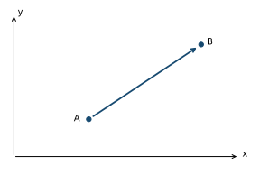
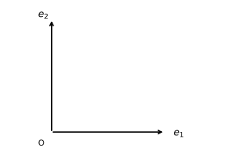

We have deliberately postponed the word **vector**. That was necessary because several different things can all be written using the same notation:

$$
[5,20].
$$

This could be a Python list, an ordered pair of measurements, coordinates of a point, coordinates of a displacement, or the coordinate representation of an abstract vector. If we simply call all of these "vectors," we lose distinctions that become critical in PCA.

Our goal now is to understand what makes something a vector and why vectors are useful.

## 1. Begin with movement, not notation

Forget datasets temporarily. Imagine an ordinary two-dimensional physical space containing two points `A` and `B`.

{width=360 fig-alt="Points A and B connected by a displacement arrow."}

There are two fundamentally different kinds of geometric objects in this picture.

`A` and `B` are **points**. They answer:

> Where?

The arrow from `A` to `B` is a **displacement**. It answers:

> From `A`, how must position change to reach `B`?

We denote that displacement by

$$
\overrightarrow{AB}.
$$

Already:

$$
\boxed{\text{point} \neq \text{displacement}}.
$$

A point represents a location. A displacement represents a change in location.

## 2. A displacement contains direction and magnitude

Suppose

$$
A=(2,1),\qquad B=(5,3).
$$

To travel from `A` to `B`, we must move:

$$
3
$$

units horizontally and

$$
2
$$

units vertically.

So:

$$
B-A=(5,3)-(2,1)=(3,2).
$$

We can represent the displacement as

$$
\overrightarrow{AB} \quad\leftrightarrow\quad (3,2).
$$

But notice the roles:

$$
\underbrace{\overrightarrow{AB}}_{\text{geometric displacement}}
$$

is not conceptually identical to

$$
\underbrace{(3,2)}_{\text{coordinates used to represent that displacement}}.
$$

The geometric displacement exists as the relationship from `A` to `B`. The pair `(3,2)` tells us how that displacement decomposes relative to our chosen horizontal and vertical reference directions.

This is one of the distinctions explicitly required by our framework: **geometric object versus coordinate list**.

## 3. Why isn't a vector simply "a list of numbers"?

Consider the Python object

```python
[3, 2]
```

Python knows only that this is a list containing two integers.

Python does not inherently know:

$$
3=\text{horizontal displacement}
$$

and

$$
2=\text{vertical displacement}.
$$

Nor does Python know whether `[3, 2]` means:

$$
[\text{age},\text{number of children}],
$$

an RGB fragment,

$$
[\text{red intensity},\text{green intensity}],
$$

a point,

$$
(x,y),
$$

or a displacement.

Therefore:

$$
\boxed{\text{list of numbers} \neq \text{vector merely because it looks vector-like}.}
$$

A vector is a mathematical object with a particular structure and interpretation. A list or NumPy array is a **computational representation** capable of storing its coordinates.

This distinction will later let us say:

```python
v = np.array([3, 2])
```

without confusing the NumPy array object with the mathematical object we intend it to represent.

## 4. What structure does a vector have?

One useful first-principles interpretation is:

> A vector represents a directed amount of change that can be combined with other such changes and scaled.

Suppose

$$
v=(3,2).
$$

Geometrically this means:

> move 3 units in one reference direction and 2 units in another.

Now suppose

$$
w=(1,4).
$$

If we perform `v`, then `w`, the total displacement is

$$
v+w=(3,2)+(1,4)=(4,6).
$$

Why addition?

Because we are **composing changes**.

First:

$$
+3\text{ horizontally},\quad +2\text{ vertically},
$$

then:

$$
+1\text{ horizontally},\quad +4\text{ vertically}.
$$

Altogether:

$$
(3+1,\;2+4)=(4,6).
$$

So vector addition is not an arbitrary rule imposed on pairs of numbers.

It expresses:

$$
\boxed{\text{change}+\text{change}=\text{combined change}.}
$$

This is exactly the kind of semantic interpretation we want behind mathematical operations.

## 5. Why scalar multiplication?

Take

$$
v=(3,2).
$$

Now calculate

$$
2v=(6,4).
$$

What happened geometrically?

The pattern of movement remained proportional:

$$
3:2
$$

became

$$
6:4.
$$

The direction therefore remained the same, but the magnitude of the displacement doubled.

Similarly,

$$
\frac12v=(1.5,1)
$$

produces half as much displacement.

And:

$$
-v=(-3,-2)
$$

reverses the direction.

So scalar multiplication expresses:

$$
\boxed{\text{same directed pattern of change, different amount}.}
$$

This is why the word **scalar** is particularly meaningful here. A scalar *scales* a vector.

## 7. Now introduce reference directions

There is still something hidden inside

$$
v=(3,2).
$$

What exactly does the first `3` mean?

What exactly does the second `2` mean?

We have silently assumed two reference directions:

$$
e_1= \begin{bmatrix} 1\\ 0 \end{bmatrix}, \qquad e_2= \begin{bmatrix} 0\\ 1 \end{bmatrix}.
$$

Geometrically:

{width=360 fig-alt="Perpendicular reference directions e1 and e2 from origin O."}

Then the displacement `v` can be constructed as

$$
v=3e_1+2e_2.
$$

Read this semantically:

> Take three units of the first reference direction and two units of the second reference direction; combine those directed amounts to construct `v`.

Now the coordinates

$$
(3,2)
$$

have acquired a much more precise meaning.

They are the **amounts of the vector relative to the chosen reference directions**.

So we can distinguish three layers:

$$
\boxed{ \begin{aligned} v &:\text{ geometric vector}\\ e_1,e_2 &:\text{ reference/basis directions}\\ (3,2)&:\text{ coordinate representation of }v\text{ under that basis}. \end{aligned}}
$$

More explicitly,

$$
v=3e_1+2e_2.
$$

This is much deeper than simply saying:

> "`v` is the vector `(3,2)`."

The latter is convenient shorthand. The former tells us what the numbers actually **mean**.

## 8. Why this matters: coordinates belong to a reference system

Imagine that we choose different reference directions `p_1,p_2`.

The same geometric vector `v` might now be expressible as

$$
v=4p_1+1p_2.
$$

Previously:

$$
v=3e_1+2e_2.
$$

Now:

$$
v=4p_1+p_2.
$$

Did the geometric vector change?

No.

What changed was its description.

Under basis `E=(e_1,e_2)`,

$$
[v]_E= \begin{bmatrix} 3\\ 2 \end{bmatrix}.
$$

Under basis `P=(p_1,p_2)`,

$$
[v]_P= \begin{bmatrix} 4\\ 1 \end{bmatrix}.
$$

Therefore:

$$
\boxed{ v\text{ stayed the same} \qquad \text{while} \qquad [v]_{\text{basis}}\text{ changed}. }
$$

This is precisely why a coordinate is not an intrinsic property of a geometric vector.

A coordinate answers:

> **How much of this object is expressed along these particular reference directions?**

Without specifying the reference directions, the coordinate list is conceptually incomplete.

We will develop this carefully in Stage 2 rather than rushing through change of basis.

## 9. Now return to our feature-space observation

Earlier we had a manufactured component represented by

$$
x=(10,40),
$$

where

$$
x_1=\text{length},\qquad x_2=\text{mass}.
$$

We treated this as a point in feature space.

We should now distinguish:

$$
\underbrace{X}_{\text{observation represented as a point}}
$$

from its coordinate representation

$$
[X]_E=(10,40).
$$

Suppose another observation is

$$
[Y]_E=(15,60).
$$

Then

$$
[Y]_E-[X]_E=(5,20).
$$

The result represents the displacement

$$
\overrightarrow{XY}.
$$

So:

$$
\boxed{ \text{point}-\text{point} = \text{displacement vector} }
$$

in the geometric interpretation we are constructing.

Notice the change in ontology.

Before subtraction:

$$
X,\;Y
$$

represent **locations**.

After subtraction:

$$
Y-X
$$

represents a **relationship between locations**.

This is exactly why subtraction will become so important in statistics.
