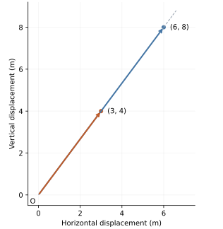

## 1. The problem hidden inside “magnitude and direction”

Lecture 4 distinguished a displacement from its coordinates and showed how addition and scalar multiplication act on displacements. We now return to a familiar sentence: **a vector is a quantity having magnitude and direction**. In our geometric setting, this sentence tells us two properties associated with a nonzero vector, but it does not yet tell us the mathematical relationship among them. Suppose I tell you that a car has a mass and a color. You would not infer

$$
\text{car}=\text{mass}\times\text{color}.
$$

Likewise, from the statement “a vector has magnitude and direction,” we are not yet entitled to write $v=(\text{magnitude})(\text{direction})$. That would jump from naming attributes to asserting a construction. Our first question must therefore be more precise: **what relationship actually connects a vector, its magnitude, and its direction?** We need to build that relationship rather than memorize it.

We continue to write a geometric vector as $v$, a basis as $E=(e_1,e_2)$, and its coordinate representation as $[v]_E$, following Lecture 4. Here the reference axes are perpendicular, equally scaled spatial axes. The numerical examples use meter measurements along both axes. They do not combine length and mass into a physical distance.

## 2. Start with displacement rather than coordinates

Imagine that we are standing at a point $O$ and move directly to another point $P$. There are two conceptually different questions we can ask: **how far apart are the starting and ending points, and which way does the displacement point?** Suppose the displacement is 5 meters northeast. If I tell you only “5 meters,” you know the amount of displacement but cannot reconstruct which way we went. Conversely, if I tell you only “northeast,” you know which way but not how far. Here magnitude means straight-line displacement size; it need not equal the length of a winding route between the points.

The vector is the complete directed displacement. Magnitude and direction are two properties we can extract from it. We can therefore establish three semantic roles:

$$
\begin{aligned}
v&=\text{the complete directed displacement},\\
\|v\|&=\text{how much displacement},\\
\text{direction of }v&=\text{which way the displacement points}.
\end{aligned}
$$

Already, this gives us an important distinction: the vector is not the same object as its magnitude. We will discuss nonzero displacements when asking “which way?” The zero vector has magnitude zero and no unique direction.

## 3. Vector versus magnitude

Suppose the coordinate representation of a displacement is

$$
[v]_E=\begin{bmatrix}3\\4\end{bmatrix}\,\mathrm m.
$$

Relative to our chosen axes, this says that the displacement consists of 3 meters horizontally and 4 meters vertically. These perpendicular components form the two legs of a right triangle. The displacement from the starting point to the ending point is its hypotenuse, so the Pythagorean relationship gives

$$
\|v\|=\sqrt{(3\,\mathrm m)^2+(4\,\mathrm m)^2}=5\,\mathrm m.
$$

Now compare the mathematical kinds of the two objects. The displacement $v$, represented by the column of components, is a **vector**. Its magnitude $\|v\|=5\,\mathrm m$ is a **scalar**. That scalar does not tell us where the vector points. For example, the following coordinate columns represent different vectors of the same magnitude:

$$
\begin{bmatrix}3\\4\end{bmatrix}\,\mathrm m,\quad
\begin{bmatrix}-3\\4\end{bmatrix}\,\mathrm m,\quad
\begin{bmatrix}0\\5\end{bmatrix}\,\mathrm m,\quad
\begin{bmatrix}-5\\0\end{bmatrix}\,\mathrm m.
$$

All have magnitude $5\,\mathrm m$, yet they point in different directions. Therefore the magnitude operation $v\mapsto\|v\|$ **extracts one property from the vector while discarding directional information**. Knowing the result of this operation is not enough to recover the original vector.

## 4. Direction does not inherently have an amount

Return to a number line with origin 0. Suppose an object starts at that origin. “Right” answers **which way?**, while “5 meters” answers **how far?** There is no reason that right itself should have a magnitude of 1 meter, 5 meters, or any other distance. The words right and left specify alternatives of orientation; they do not specify how much displacement occurs. Thus **direction itself is not an amount**.

This is why the phrase “direction vector” needs care. A vector used to represent a direction has a magnitude, but that does not mean the direction being represented intrinsically possesses an amount. To see how numerical representation can nevertheless work, we should first examine the familiar sign system on a line.

## 5. The sign is already doing something remarkable in one dimension

With right chosen as the positive direction, the displacement coordinate $+5\,\mathrm m$ communicates two pieces of information: the sign $+$ indicates right, and the magnitude $5\,\mathrm m$ indicates amount. Similarly, $-5\,\mathrm m$ communicates left and the same amount. We can expose these semantic roles as

$$
+5\,\mathrm m\;\longleftrightarrow\;(\text{right},5\,\mathrm m),\qquad
-5\,\mathrm m\;\longleftrightarrow\;(\text{left},5\,\mathrm m).
$$

These correspondences are not definitions equating numbers with ordered pairs. They expose the information hidden inside signed notation. The sign answers “which of the two available directions?” The absolute value answers “how much?” Thus $|+5\,\mathrm m|=5\,\mathrm m$ and $|-5\,\mathrm m|=5\,\mathrm m$. Taking absolute value discards the directional distinction while retaining amount.

## 6. Why two signs stop being sufficient in two dimensions

Now imagine that you are no longer restricted to a line. You stand at an origin on a flat floor. You can move right, left, up, down, northeast, northwest, or in infinitely many directions between them. In one dimension there are only two directions, so two signs are sufficient. In two dimensions, a single choice between $+$ and $-$ cannot distinguish all possible orientations.

What should our notation be? We could try to invent a separate symbol for every possible direction, but there would have to be infinitely many. This is the point at which coordinates become useful. However, moving from “which way” to numerical coordinates requires care: a direction and its numerical representation are not the same object.

## 7. Coordinates do not give an amount to direction

Suppose I say, “Move 3 meters right and 4 meters upward.” We represent this displacement by $[v]_E=(3,4)^{\mathsf T}\,\mathrm m$. The numbers have specific meanings relative to our chosen axes: $3\,\mathrm m$ is the rightward component, and $4\,\mathrm m$ is the upward component. The representation is not saying that direction has the number 3 or the number 4. It describes a displacement through its relationships with two chosen reference directions.

The coordinate column is therefore a numerical representation of a **directed displacement**. Its direction is one particular orientation between right and up. We should keep three things separate: the direction, the directed displacement, and the coordinates representing that displacement. They are related, but they are not identical. This continues the distinction from Lecture 4 between a geometric object and its description under a basis.

## 8. Different amounts can share the same direction

Compare two displacements whose coordinate representations are

$$
[a]_E=\begin{bmatrix}3\\4\end{bmatrix}\,\mathrm m,\qquad
[b]_E=\begin{bmatrix}6\\8\end{bmatrix}\,\mathrm m.
$$

The second goes twice as far as the first. But if we draw both as arrows starting at the same origin, their arrowheads lie on the same ray. The amounts differ; the **which-way relationship** does not.

{width=440}

The displacements represented by $(3,4)^{\mathsf T}\,\mathrm m$, $(6,8)^{\mathsf T}\,\mathrm m$, and $(0.3,0.4)^{\mathsf T}\,\mathrm m$ therefore contain different amounts of displacement but share the same orientation. Direction is not any one of those vectors; it is a common directional property they share.

This is analogous to the one-dimensional observation that $+1$, $+5$, and $+100$, interpreted in the same measurement unit, have different amounts but share the property positive/rightward. Likewise, $-1$, $-5$, and $-100$ share negative/leftward. This is our bridge from one dimension to higher dimensions: we can recognize a shared direction without requiring equal amounts.

## 9. Representation versus the thing represented

On the number line, we can describe the family of positive displacements without claiming that right itself equals $+1$. The number $+1$ is a particularly convenient representative because its numerical magnitude is one. Similarly, $-1$ is a convenient representative of leftward orientation. This is where the notion of a unit vector should eventually enter: **we can choose a standardized vector to represent a direction**. That is different from claiming that direction itself is a number.

The distinction is already familiar in other forms. The word “right” is a linguistic representation of a direction. The arrow $\rightarrow$ is a graphical representation. The sign $+$ can distinguish one of two orientations on a number line. In higher dimensions, a column such as $(0.6,0.8)^{\mathsf T}$ can be used as a numerical representation associated with a particular direction. The numbers do not become the direction itself.

However, we have not yet established why $(0.6,0.8)^{\mathsf T}$ should be selected as the standard representative of the direction shared by $(3,4)^{\mathsf T}$ and $(6,8)^{\mathsf T}$. Consequently, writing down a division by 5 now would introduce a procedure before establishing its semantic role. The next question must be narrower: **why would mathematics want to choose one standard vector from all vectors pointing the same way?** Only after that has a convincing answer should we ask why its magnitude should be one, and only afterward should division enter the construction.

## 10. The problem: one direction, infinitely many representatives

Consider the number-line displacements $+37$, $+5$, and $+0.01$ in a shared unit. All point right. If our question is only “which way?”, the amount 37 is irrelevant to distinguishing right from left. The same happens in two dimensions: $a$ and $b$ above have magnitudes $5\,\mathrm m$ and $10\,\mathrm m$, but point the same way. For a question only about direction, their different magnitudes are unwanted information.

This creates a representation problem: **how can we represent what these vectors have in common while ignoring their different amounts?** That is the need that motivates standardization. We are not claiming that direction itself has an amount; we are deciding how to represent a property shared by many vectors.

## 11. Why not simply keep saying “northeast”?

For ordinary conversation, we can say “northeast,” “right,” or “toward the door.” But mathematics often needs to calculate with direction, not merely name it. A robot may need to travel 17 meters in a particular direction; a force of 23 newtons may act in that direction; later, we may want to determine how much of one vector lies along another direction.

A compass word does not distinguish arbitrary orientations precisely enough. An angle can describe orientation, but a vector representation can be more directly usable for operations involving components and scaling. Mathematics therefore makes a modeling decision: **represent a direction using a vector pointing that way**. Immediately, however, we must ask which vector. The component patterns $(3,4)^{\mathsf T}$, $(6,8)^{\mathsf T}$, $(30,40)^{\mathsf T}$, and $(0.3,0.4)^{\mathsf T}$ all qualify. There is no unique choice yet.

## 12. Remove the arbitrary choice by standardizing size

Imagine two programmers describing exactly the same direction. One stores $(3,4)^{\mathsf T}$ and the other stores $(30,40)^{\mathsf T}$. Their intended which-way information agrees, but their representations contain different amounts. A calculation using those components would inherit an arbitrary scale unless it explicitly accounted for that difference.

We therefore want a convention: **every direction should receive a standard-sized representative**. The wording matters. We are not saying that direction has a size. We are saying that the vector chosen to represent direction will have a standardized size. The original displacement can keep its original magnitude; standardization concerns the separate representative we choose for its direction.

## 13. The number line explains why one is convenient

All positive displacements point right. We could choose $+7$ as a standard rightward representative. But a numerical displacement of 21 would then be written $21=3(7)$: the coefficient 3 counts copies of the representative and does not itself equal the desired amount 21. Choosing $+100$ would create the same kind of extra conversion.

There is one especially useful choice, $+1$, because

$$
+5=5(+1),\qquad +37=37(+1),\qquad +0.2=0.2(+1).
$$

Now the coefficient directly gives the amount. This happens because 1 is the multiplicative identity: multiplying by it leaves the amount unchanged. Thus $+1$ is not chosen because right has an intrinsic amount of one. It is chosen because its standardized numerical magnitude makes it a convenient rightward representative.

For physical quantities, we must also keep the units explicit. We can write $+5\,\mathrm m=(5\,\mathrm m)(+1)$ and $-5\,\mathrm m=(5\,\mathrm m)(-1)$. Here the amount carries meters, and the standardized representatives $+1$ and $-1$ are dimensionless. We have exposed two roles that were hidden inside signed notation:

$$
\underbrace{-5\,\mathrm m}_{\text{complete displacement coordinate}}
=\underbrace{5\,\mathrm m}_{\text{amount}}
\underbrace{(-1)}_{\text{standard leftward representative}}.
$$

The signs distinguish orientation; the numbers $+1$ and $-1$ are mathematical objects that can serve as standardized representatives of those orientations.

## 14. Specify the two-dimensional representative before calculating it

Neither $+1$ nor $-1$ alone describes the orientation shared by $(3,4)^{\mathsf T}$ and $(6,8)^{\mathsf T}$. We want the two-dimensional analogue of what $+1$ did for right. Can we find a vector pointing in the 3–4 direction whose magnitude is exactly one?

Call the desired representative $u$. We have not yet calculated it; we are specifying its required behavior. It must point the same way as $v$, and it must satisfy $\|u\|=1$. This second condition is a standardization rule for the representative, not a claim that the underlying direction inherently has magnitude one.

In the convention used here, $u$ and its coordinates $[u]_E$ are dimensionless. A physical amount, such as $5\,\mathrm m$, supplies the units when multiplied by $u$. This keeps the role of the representative distinct from the role of a physical displacement. We first specify the behavior we need, then investigate which mathematical construction produces it.

## 15. Why magnitude one makes the coefficient meaningful

Suppose we have found $u$. Lecture 4 established the geometric meaning of positive scalar multiplication: every component is scaled by the same factor, preserving direction and multiplying the size. In our perpendicular, equally scaled axes, we can also check that relationship explicitly. If $[u]_E=(u_1,u_2)^{\mathsf T}$, the requirement $\|u\|=1$ means $\sqrt{u_1^2+u_2^2}=1$. For a nonnegative dimensionless scalar $a$,

$$
\|au\|=\sqrt{(au_1)^2+(au_2)^2}
=\sqrt{a^2(u_1^2+u_2^2)}
=a\sqrt{u_1^2+u_2^2}=a.
$$

The first step computes size from the scaled components. The next exposes the common factor $a^2$. Since $a$ is nonnegative, its square root is $a$; the remaining factor is the unit representative's magnitude, one. This is why $5u$ has magnitude 5, $10u$ has magnitude 10, and $0.5u$ has magnitude 0.5. For a negative scalar, the magnitude is $|a|$ and the direction reverses; zero gives the zero vector.

The physical version is equally precise: $(5\,\mathrm m)u$ is a displacement of magnitude $5\,\mathrm m$. We have separated two semantic jobs: the nonnegative amount says **how much**, and $u$ supplies the **standardized which-way representative**. The representative's magnitude contributes only the multiplicative identity, so the coefficient can carry the amount directly.

## 16. Arrive at multiplication before asking about division

For the original displacement, $[v]_E=(3,4)^{\mathsf T}\,\mathrm m$ and $\|v\|=5\,\mathrm m$. We now want to express it as five meters times a dimensionless unit vector pointing the same way:

$$
v=(5\,\mathrm m)u.
$$

If we work only with the numerical coordinates after declaring meters as the measurement unit, the corresponding relation is

$$
\begin{bmatrix}3\\4\end{bmatrix}=5[u]_E.
$$

Division has not been used to construct $u$. We arrived at multiplication first because we understand its job: starting with a unit-sized directional representative, scaling by five produces the same orientation with five times the magnitude. The multiplication relation is now motivated by the required behavior, rather than inferred merely from the phrase “magnitude and direction.”

We finally have a precise situation in which division can be investigated. We know the result, the coordinate column $(3,4)^{\mathsf T}$. We know the scaling factor, 5. We want to recover the representative before that scaling. Our next question is therefore: **if $(3,4)^{\mathsf T}=5[u]_E$, what operation reverses the scaling by 5?** That is where we are ready to reconstruct the semantic meaning of division, rather than import it as a memorized rule.

## Python companion

The companion keeps magnitude, displacement, and orientation as distinct semantic types. It checks the examples already established here: vectors of equal magnitude can point differently, positive multiples share a ray, and the one-dimensional representatives $+1$ and $-1$ carry orientation while the amount carries meters. It deliberately leaves the construction of a two-dimensional unit vector to the next lecture.

```{python}
#| echo: false
from pathlib import Path
import runpy

_ = runpy.run_path(
    str(Path("examples/05_direction_and_standard_representatives.py")),
    run_name="__main__",
)
```
