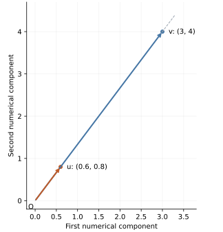

## 1. The question we have earned the right to ask

Lecture 5 established the conceptual situation that must exist before division can make sense. Many vectors can point the same way, and we deliberately choose a representative of magnitude one so that a separate coefficient can carry the amount. We now need to construct that representative. Throughout, $v$ names a vector, $[v]_E$ its coordinates in the fixed perpendicular, equally scaled basis $E$, and $u$ its unit direction representative. We first work with the dimensionless numerical model of the coordinates; we will explicitly restore physical units when we examine unit cancellation.

For our running example,

$$
[v]_E=\begin{bmatrix}3\\4\end{bmatrix},\qquad \|v\|=5.
$$

We want $u$ to point the same way and satisfy $\|u\|=1$. Our desired relationship is therefore $v=5u$. We did not obtain this merely from the slogan “vectors have magnitude and direction.” We deliberately chose a unit-sized representative: scaling it by five produces a vector of magnitude five in the same direction. The question is now precise: **given the scaled object $5u$, how do we recover $u$?**

## 2. First remove vectors entirely

Consider $15=5(3)$. The number 3 is the original amount, multiplication by 5 is the scaling operation, and 15 is the scaled amount. Now suppose we know the result 15 and know that it was produced by multiplying an unknown quantity $q$ by 5:

$$
15=5q.
$$

Our first question is not which arithmetic symbol to use. It is: **what must happen to the scaled quantity so that the effect of scaling by five is removed?** We need to turn the multiplicative factor 5 into 1, because $1q=q$. Multiplying that factor by its reciprocal does exactly what we need: $(1/5)5=1$. Consequently,

$$
\frac15(5q)=\left(\frac15\cdot5\right)q=1q=q.
$$

For the known result, $(1/5)15=3$. Division by five can therefore **undo multiplication by five**. This is an inverse-scaling interpretation of division. Sharing is another useful interpretation, but the active role here is recovering an object from a known scaling of it.

Notice what guided the algebra. We wanted to isolate $q$. The factor 5 prevented that. We selected the reciprocal because it turns that factor into the multiplicative identity. The next line was chosen to serve a goal; it did not follow merely because a particular symbol happened to be available.

## 3. Dividing a vector by a scalar means reciprocal scaling

For ordinary numbers, $q/5=(1/5)q$. The second form exposes how the operation can act on a vector. We already know scalar multiplication, so we define division by the nonzero scalar 5 through that operation:

$$
\frac{v}{5}:=\left(\frac15\right)v.
$$

The fundamental vector operation is still scalar multiplication. The reciprocal belongs to the scalar. This notation does not introduce a general operation in which one vector is divided by another vector.

Starting from $v=5u$, apply the same reciprocal scaling to both sides. Applying the same operation preserves the equality, while combining the scalar factors exposes the object we wanted:

$$
\frac15v=\frac15(5u)
=\left(\frac15\cdot5\right)u
=1u=u.
$$

Thus $u=(1/5)v$. Scalar multiplication acts on every coordinate, so

$$
[u]_E=\frac15\begin{bmatrix}3\\4\end{bmatrix}
=\begin{bmatrix}3/5\\4/5\end{bmatrix}
=\begin{bmatrix}0.6\\0.8\end{bmatrix}.
$$

The division is no longer arbitrary. We knew the scaling factor was five, and we applied its reciprocal to undo that scaling. The algebra constructs a candidate for the representative; we should now interpret and check what it produced.

## 4. What changed, and what was preserved?

Before the operation, the components were 3 and 4 and the magnitude was 5. Afterward, the components are 0.6 and 0.8, and

$$
\|u\|=\sqrt{0.6^2+0.8^2}=\sqrt{0.36+0.64}=1.
$$

The coordinates changed, and the magnitude changed. But both components were multiplied by exactly the same positive factor $1/5$. Their relative pattern is unchanged: $3/4=0.6/0.8$. The arrow therefore shrinks along its existing ray instead of rotating to another ray.

{width=440}

The operation has the behavior we required: **change magnitude while preserving direction**. The ratio check is convenient for this example because both components are nonzero. The more general reason is positive uniform scaling; it also applies to axis-aligned vectors whose coordinate ratios may be undefined.

Unit magnitude does not mean that the components add to one. Here $0.6+0.8=1.4$, while $0.6^2+0.8^2=1$. The components describe contributions along perpendicular axes. They are not two shares partitioning a single whole under ordinary addition. The Euclidean magnitude is computed from their squared contributions.

## 5. Why divide by the magnitude specifically?

Many positive scaling factors preserve direction. Multiplying $v$ by $1/2$, for example, preserves its ray but produces magnitude $2.5$, not one. So direction preservation alone does not select the reciprocal we need. The other requirement—unit magnitude—must determine the factor.

Let $r=\|v\|>0$, and suppose we scale $v$ by a positive scalar $a$. We want to choose $a$ so that the resulting magnitude is one. To do that, we need a relationship between the old magnitude $r$ and the new magnitude $R=\|av\|$. This is the point at which the second part of our learning problem enters: **how do we choose algebraic steps that expose a relationship we need?**

Lecture 5 used the scaling relationship for a unit vector. We will now reconstruct it for an arbitrary vector, explaining why each transformation is selected. This will justify the general normalization formula rather than merely extending the numerical example by resemblance.

## 6. Give the algebra a destination

Write $[v]_E=(x,y)^{\mathsf T}$. Here $x$ and $y$ are component numbers, not points or separate vectors. The old magnitude is $r=\sqrt{x^2+y^2}$. If we scale by five, the new components are $5x$ and $5y$, so

$$
R^2=(5x)^2+(5y)^2.
$$

Our goal is **to express $R$ in terms of $r$**. That is the mathematical equivalent of knowing which relationship a program should expose. The current expression contains $x$ and $y$, while our desired answer should contain $r$. We already know $r^2=x^2+y^2$, but the right-hand side does not yet visibly contain the grouped pattern $x^2+y^2$.

The task is therefore specific: rewrite the current expression until the known pattern becomes visible. We are not transforming it simply because a rule called “simplification” exists. We want a form that lets us use an established relationship.

## 7. Expand to expose the scale, factor to expose the known pattern

In $(5x)^2$, the factor 5 is inside a squared product. Squaring the product gives $(5x)(5x)=25x^2$; similarly, $(5y)^2=25y^2$. This reveals how the scale participates in each contribution:

$$
R^2=25x^2+25y^2.
$$

Why expand? Because the same scale was hidden inside two separate squared products. Expansion makes the common factor 25 visible. But the pattern we need, $x^2+y^2$, is still split across terms carrying that factor. We use the distributive law in reverse:

$$
25x^2+25y^2=25(x^2+y^2).
$$

Why factor? Because factoring exposes $x^2+y^2$ as one grouped subexpression. We know that this group equals $r^2$, so we can replace it by the quantity it represents:

$$
R^2=25(x^2+y^2)=25r^2.
$$

The substitution removes the component-level details from the expression and exposes the relationship between magnitudes. We have preserved the value throughout; only its representation has changed. To finish the stated goal, take the nonnegative square root. Magnitudes are nonnegative, so

$$
R=\sqrt{25r^2}=5r.
$$

There is no negative alternative for $R$ here: $R$ denotes magnitude. We have now derived that scaling both components by five scales the magnitude by five.

## 8. Read the derivation as a program transformation

The same transition can be written using meaningful Python names:

```python
old_magnitude_squared = x**2 + y**2
new_magnitude_squared = (5 * x)**2 + (5 * y)**2
```

The first assignment names a meaningful quantity. Our algebra rewrites the expression in the second assignment until it contains the expression from the first:

```python
new_magnitude_squared = 25 * (x**2 + y**2)
```

We can then expose the semantic relationship directly:

```python
new_magnitude_squared = 25 * old_magnitude_squared
```

These snippets illustrate the mathematical correspondence, not an instruction to recompute every equivalent form in production code. Over exact real arithmetic, the expressions are equal. Floating-point implementations may differ slightly in rounding or overflow behavior, which is why the companion tests use tolerances and its magnitude calculation uses `math.hypot`.

The central design principle is to ask **what form we need and which known relationship we want to expose**. In this example, the target is a relationship involving $r$; the known identity is $r^2=x^2+y^2$; the obstacle is the scale hidden inside the squared products; and the useful transformations are expansion, factoring, and substitution. Taking the nonnegative square root then completes the goal of expressing $R$, not merely $R^2$.

This is close to ordinary programming reasoning. A function is introduced to expose a reusable operation; a class can keep related state and behavior together; a conditional expresses a selection criterion. In each case, a construct serves an objective. Likewise, factoring is useful here because it exposes a meaningful subexpression. The factored form is not universally better than the expanded form; it is better suited to our current question.

## 9. Generalize the relationship, then choose the reciprocal

Replace five by a real scalar $a$. The same steps give

$$
\begin{aligned}
R^2&=(ax)^2+(ay)^2\\
&=a^2x^2+a^2y^2\\
&=a^2(x^2+y^2)\\
&=a^2r^2.
\end{aligned}
$$

The first line computes the squared magnitude from scaled components. Expansion exposes the common factor $a^2$; factoring exposes the old squared magnitude; substitution names it $r^2$. Since $\sqrt{a^2}=|a|$ and $r\geq0$, the conclusion is

$$
\|av\|=|a|\|v\|.
$$

For direction-preserving scaling, we require $a>0$, so the new magnitude is $ar$. The unit-magnitude requirement now becomes the scalar equation $ar=1$. Since $r>0$, choosing $a=1/r$ produces exactly one. Therefore the construction is

$$
u=\frac1{\|v\|}v=\frac{v}{\|v\|},\qquad v\ne0.
$$

We can verify both requirements directly. The factor $1/\|v\|$ is positive, so direction is preserved. The magnitude is

$$
\|u\|=\frac1{\|v\|}\|v\|=1.
$$

This answers why we divide by the magnitude specifically: its reciprocal is the positive scale that turns the original magnitude into one. For a nonzero vector, it selects the unique unit-sized representative on that ray. A negative factor would reverse direction, and the zero vector cannot be normalized because its magnitude is zero and it has no unique direction to preserve.

## 10. The bananas analogy: identify the factor to recover

Now we can connect normalization to an elementary factor-isolation problem. Suppose two persons each consume two bananas per person. The relation is

$$
(2\,\text{persons})\left(\frac{2\,\text{bananas}}{\text{person}}\right)
=4\,\text{bananas}.
$$

Suppose we know the total bananas and the consumption rate, and want to recover the number of persons. Dividing by the rate isolates that factor:

$$
\frac{4\,\text{bananas}}{2\,\text{bananas/person}}=2\,\text{persons}.
$$

The units explain the resulting kind of quantity: $\text{bananas}/(\text{bananas/person})=\text{person}$. The answer is persons, not persons per banana. If instead we divided the total by the number of persons, we would recover the consumption rate. The same starting relationship supports different operations depending on which factor we want.

The vector relationship is now justified as $v=\|v\|u$. Read its roles: $v$ is the complete directed quantity, $\|v\|$ is its amount, and $u$ is its unit-sized direction representative. If we want the representative, the amount is the factor to remove:

$$
\frac{v}{\|v\|}=\frac{\|v\|u}{\|v\|}=u.
$$

This is the same factor-isolation pattern as the bananas example. The distinction is in the kinds of the factors: in the vector equation, a scalar quantity scales a vector. The analogy explains the role of division; the preceding geometric argument establishes why this particular factorization is valid.

## 11. Unit cancellation and scale standardization

Until now, our vector calculations used the dimensionless numerical model. Restore the spatial interpretation by taking the physical displacement to have coordinates

$$
[v]_E=\begin{bmatrix}3\\4\end{bmatrix}\,\mathrm m,
\qquad \|v\|=5\,\mathrm m.
$$

Its direction representative is dimensionless:

$$
[u]_E=\frac{(3,4)^{\mathsf T}\,\mathrm m}{5\,\mathrm m}
=\begin{bmatrix}0.6\\0.8\end{bmatrix}.
$$

There are two related effects. The meter units cancel because each component is divided by a magnitude measured in meters. At the same time, the original scale is standardized to one. Merely changing meters to centimeters would change coordinate numbers while preserving the physical displacement; normalization instead constructs a separate, dimensionless representative whose role is direction.

Lecture 4 also used the 3–2 displacement. Call that example $w$ to distinguish it from our running 3–4 example. With $[w]_E=(3,2)^{\mathsf T}\,\mathrm m$, its magnitude is $\sqrt{13}\,\mathrm m$ and its representative has coordinates

$$
[u_w]_E=\begin{bmatrix}3/\sqrt{13}\\2/\sqrt{13}\end{bmatrix}.
$$

The same construction applies. It relies on the compatible spatial units and Euclidean geometry declared for these examples. It does not give physical meaning to adding squared lengths and squared masses in an unscaled feature vector.

## 12. One object can carry several distinguishable roles

A mathematical object can carry several pieces of information, and an operation can make one explicit while discarding or standardizing another. A nonzero vector carries both which-way and how-much information. We have now established, rather than assumed from a slogan, a multiplicative representation that separates those roles:

$$
\underbrace{v}_{\text{complete displacement}}
=\underbrace{\|v\|}_{\text{amount}}
\underbrace{u}_{\text{unit direction representative}}.
$$

More generally, when $C=AB$ and $A$ is a nonzero scalar factor, recovering $B$ can be expressed as $B=A^{-1}C$. The meaningful question is which factor represents the quantity we want. In the bananas example, dividing total consumption by the rate recovers persons. In normalization, dividing the vector by its magnitude recovers the representative. This is not a license to divide arbitrary mathematical objects; the inverse and its action must be defined for the kinds involved.

The connection among arithmetic, algebra, and geometry becomes visible once those roles are explicit. We first identify the relationship, then decide which object to recover, then choose an operation whose effect matches that goal.

## 13. Extraction loses information; keeping both pieces permits reconstruction

Extracting magnitude, $v\mapsto\|v\|$, loses direction. Knowing only that the magnitude is five does not distinguish the vectors represented by $(3,4)^{\mathsf T}$, $(-3,4)^{\mathsf T}$, or $(0,5)^{\mathsf T}$ in our numerical model. Likewise, normalization, $v\mapsto u$, discards the original amount. Knowing $u$ alone cannot distinguish whether the original vector was $u$, $2u$, $100u$, or $0.01u$.

But retaining both pieces permits reconstruction:

$$
v\longmapsto\left(\|v\|,\frac{v}{\|v\|}\right)
\quad\text{and}\quad
(r,u)\longmapsto ru.
$$

For the physical 3–4 displacement, retain $r=5\,\mathrm m$ and $[u]_E=(0.6,0.8)^{\mathsf T}$. Multiplying them gives $[v]_E=(3,4)^{\mathsf T}\,\mathrm m$ again. The pair is an ordered record of amount and representative, not a sum of a scalar and a vector. For nonzero vectors, the pair together retains enough information to reconstruct the original exactly in real arithmetic.

This distinguishes extraction from reconstruction. The magnitude alone and the representative alone each omit information. Their combination restores the complete directed quantity. Normalization does not turn a vector into an abstract direction with no representation; it constructs another vector whose fixed magnitude lets its orientation serve as the relevant information.

## 14. Carry the reasoning into Stage 2

The algebraic skill developed here is to choose transformations by their purpose. Before moving to another line, identify the desired quantity, the relationship already known, the structure currently hiding it, and an equality-preserving transformation that exposes it. In the scaling derivation, those decisions led us from component squares to the old magnitude. In normalization, they led us from a required unit magnitude to a reciprocal scaling factor. In factor isolation, they determined which known factor to remove.

The geometric skill is to track what an operation retains. Magnitude extraction retains amount and loses direction; normalization retains direction in a standardized representative and loses the original amount; keeping both allows reconstruction. These distinctions complete the present Stage 1 discussion and provide the foundation for returning to Stage 2 of the original sequence. As reference directions, coordinates, and later projections are introduced, we will keep asking what each object represents, what relationship is being exposed, and why the selected operation answers that question.

## Python companion

The implementation keeps meter-valued displacement components separate from dimensionless direction components. A `UnitDirection2D` validates its unit-magnitude invariant, while a `MagnitudeDirection` stores the two pieces required for reconstruction. The companion executes the scaling identity, normalization, and reconstruction examples below. Its checks compare geometric relationships with floating-point tolerances.

```{python}
#| echo: false
from pathlib import Path
import runpy

_ = runpy.run_path(
    str(Path("examples/06_normalization_and_algebraic_reasoning.py")),
    run_name="__main__",
)
```

The implementation rejects zero for normalization and rejects nonfinite inputs. It uses a preliminary numerical rescaling before calculating the unit representative, so very small or large finite component values do not require forming an unsafe reciprocal first. This is an implementation of the same mathematical result. Decomposition additionally requires the magnitude to be representable as a finite Python float. The semantic annotations document roles for mypy; runtime validation enforces the numerical invariants, not a general physical-units system.
