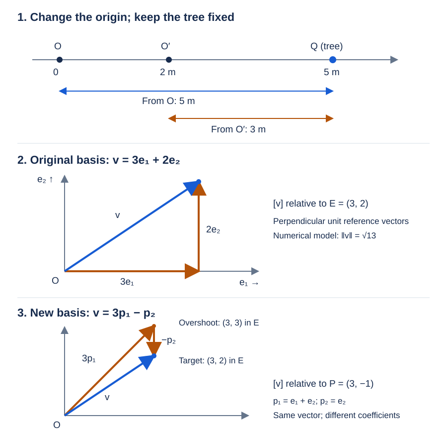

## 1. What is a coordinate relative to?

Stage 1 established the distinctions we need before discussing coordinates. We separated the object being represented from its numerical representation, distinguished points from displacement vectors, and examined magnitude, direction, and normalization. Lecture 6 also developed a way to reason about algebra: identify the desired result, find a known relationship, and choose transformations that expose the structure needed to reach that result. We now carry those distinctions and that reasoning into Stage 2.

Our opening question sounds elementary, but ordinary coordinate notation often conceals it: **when we write a coordinate such as \(3\), what exactly is that \(3\) relative to?** A number can be perfectly definite while its intended meaning remains incomplete. To understand a coordinate, we must identify the reference that gives the number its role.

We will develop the answer in the order required by the problem. First, an origin establishes where position measurements begin. Next, reference vectors establish the directions and scales used to construct displacements. Coordinates then become the signed coefficients required in that construction. Finally, we will hold one vector fixed, choose another basis, and calculate why the same vector receives different coordinates.

## 2. A number alone is not a position

Suppose I tell you that an object is “at \(5\).” The statement sounds precise because it contains a number, but several questions remain unanswered. Five what? Five from where? Five in which direction? Imagine a straight road with a tree beside it. The tree occupies a location, but the road does not come with a numerical coordinate system already attached.

Choose a particular point \(O\) on the road as our reference location. Then choose the rightward direction as positive and meters as our measurement unit. If the tree lies five meters to the right of \(O\), we can now assign it the coordinate \(5\,\mathrm{m}\). The statement means: starting at the chosen origin, move five meters in the chosen positive direction.

Let \(Q\) denote the tree's geometric location. We use \(Q\) for a point throughout this lecture so that the capital letter \(P\) can later name a basis without acquiring a second role. With orientation and units fixed, write

$$
[Q]_O=5\,\mathrm{m}.
$$

The brackets identify a representation. The subscript identifies the origin used for that representation. The notation abbreviates a fuller reference specification: it assumes the right-positive orientation and meter convention just declared. If those conventions changed, stating the origin alone would no longer be enough.

A coordinate is therefore an amount embedded in a reference system. The numerical value becomes positional information only after the reference gives it an interpretation.

## 3. The origin answers “from where?”

The point \(O\) is called the origin. Its essential purpose is to answer: **from where are positions being measured?** In a familiar two-dimensional drawing, the origin is where the coordinate axes cross, but the measurement reference is the underlying idea.

We assign the origin itself coordinate zero:

$$
[O]_O=0\,\mathrm{m}.
$$

This notation deliberately distinguishes the point from the number assigned to it. Writing \(O=0\) is a common shorthand, but here we want to keep the object and its representation visible.

Now choose another origin \(O'\), two meters to the right of \(O\), while keeping the positive direction and unit unchanged. Relative to the original origin,

$$
[O']_O=2\,\mathrm{m},
\qquad
[Q]_O=5\,\mathrm{m}.
$$

Our target is the tree's coordinate relative to \(O'\). The known relationship is that traveling from \(O\) to \(O'\), then from \(O'\) to \(Q\), reaches the same point as traveling directly from \(O\) to \(Q\). In signed coordinates,

$$
[Q]_O=[O']_O+[Q]_{O'}.
$$

The term \([O']_O\) is the part contributed by the old origin's displacement to the new origin. Subtracting it from both sides isolates the relationship we want:

$$
[Q]_{O'}
=
[Q]_O-[O']_O
=
5\,\mathrm{m}-2\,\mathrm{m}
=
3\,\mathrm{m}.
$$

The tree did not move. Its coordinate changed because the starting point for the measurement changed. Thus a change in coordinate does not by itself establish a change in the represented object.



## 4. The object and its representation have different roles

We can now place the two descriptions beside each other:

$$
[Q]_O=5\,\mathrm{m},
\qquad
[Q]_{O'}=3\,\mathrm{m}.
$$

There is one point \(Q\), described relative to two origins. Neither coordinate is a number intrinsically stored inside the point. Each expresses a relationship between the point and a declared reference system.

This improves the statement “the coordinate tells us where the point is.” More precisely, the coordinate numerically describes the point's position relative to a reference. The represented location and its numerical description have different roles, even though ordinary notation sometimes identifies them for convenience.

A familiar analogy is temperature. The same temperature can be reported as \(20^\circ\mathrm{C}\) or \(68^\circ\mathrm{F}\). The physical state has not become hotter because the numerical value increased. Both the zero reference and the unit size differ between the scales. This example is an analogy about representation; we are not treating temperature as a spatial vector. Its purpose is to expose the shared distinction between a quantity and the numbers used to describe it.

## 5. An origin alone is insufficient

Suppose I tell you to start at \(O\) and travel five meters. You still cannot determine the destination. On the road, you could travel right or left. In a plane, there are infinitely many possible orientations. An origin answers “from where?” but an amount alone does not answer “along what?”

To proceed, we choose a reference vector \(e_1\). It has an orientation and a scale: taking one copy of it defines one reference step. In the examples that follow, we first use a dimensionless numerical Euclidean model. The reference vectors \(e_1\) and \(e_2\) will be perpendicular and have magnitude one. We return explicitly to meters when connecting the mathematics to the Python companion.

In this numerical model,

$$
3e_1
$$

means three copies of the chosen reference vector, whereas

$$
-3e_1
$$

means three copies in the opposite orientation. The sign expresses orientation relative to the chosen positive reference. It does not describe an absolute orientation independent of that reference.

This connects to Lecture 5's right-positive number line. A positive coefficient follows the reference orientation; a negative coefficient reverses it. A zero coefficient contributes no displacement along that reference vector.

## 6. Separate the reference vector from its coefficient

Consider

$$
v=3e_1.
$$

The symbol \(v\) denotes the resulting geometric vector. The symbol \(e_1\) denotes the chosen reference vector. The number \(3\) is the coefficient that tells us how many copies of \(e_1\) construct \(v\). These are three distinct roles.

Because \(e_1\) has magnitude one in our present model, the coefficient's absolute value also gives the resulting magnitude:

$$
\|3e_1\|=|3|\|e_1\|=3.
$$

The coefficient has this direct magnitude interpretation because of the unit-length choice. A general reference vector need not have magnitude one. For a nonunit reference vector \(b\), the vector \(3b\) has magnitude \(3\|b\|\), rather than necessarily having magnitude three.

This distinction extends Stage 1 without undoing it. Normalization deliberately selected a unit representative so that a separate coefficient could directly carry magnitude. A basis, however, can use reference vectors with other magnitudes. Its coordinates always count signed multiples of the chosen vectors; whether those numbers directly measure lengths depends on the reference vectors' scales.

## 7. Two dimensions require two independent reference vectors

Scaling \(e_1\) alone reaches only vectors along its line. To describe every vector in a plane, we need another reference vector \(e_2\) that is not a scalar multiple of \(e_1\). Our initial choice is perpendicular to \(e_1\), with both vectors having magnitude one.

Suppose the displacement of interest is constructed by taking three copies of \(e_1\) and two copies of \(e_2\). Then

$$
v=3e_1+2e_2.
$$

Read this as a construction relationship: the vector \(v\) is obtained by adding the directed contribution \(3e_1\) to the directed contribution \(2e_2\). Vector addition combines the displacements.

Let

$$
E=(e_1,e_2)
$$

denote the ordered basis. Its order matters because it determines which coefficient belongs in each coordinate position. We write

$$
[v]_E=
\begin{bmatrix}
3\\
2
\end{bmatrix}.
$$

The column records the coefficients from the construction equation. It is a representation of \(v\) relative to \(E\).

| Symbol | Mathematical role |
|:--|:--|
| \(v\) | The geometric vector being represented |
| \(e_1,e_2\) | The chosen reference vectors |
| \(E=(e_1,e_2)\) | The ordered basis |
| \(3,2\) | The coefficients multiplying those basis vectors |
| \([v]_E\) | The coordinate column relative to \(E\) |

A basis is a collection of reference vectors that allows every vector in the space to be expressed uniquely as their linear combination. In a plane, two nonparallel vectors provide this property. They span the plane, so the construction is possible, and they are independent, so its coefficients are unique. We will revisit these properties later; here they explain why coordinates give one definite answer once the basis is fixed.

## 8. Origin and basis solve different reference problems

The origin and basis are often introduced together as “the coordinate system,” which can hide their separate jobs. The origin supplies the starting point for describing a position. The basis supplies the reference vectors for describing a displacement. Coordinates supply the coefficients required along those vectors.

For a point \(Q\), first form the displacement from a chosen origin \(O\) to \(Q\). Then represent that displacement in basis \(E\):

$$
[Q]_{(O,E)}
=
[\overrightarrow{OQ}]_E.
$$

The left side is the coordinate representation of a point in a frame. The right side explains its construction through a displacement and a basis. Our earlier notation \([Q]_O\) suppressed the fixed orientation and scale of the one-dimensional frame.

A free vector has a different dependency. It describes a displacement without storing a starting location. Its basis coordinates \([v]_E\) therefore do not require a separate origin. Translating the origin while leaving the basis unchanged changes point coordinates but does not change the coordinates of a fixed free vector.

For example, suppose two points on the road have coordinates \(1\,\mathrm{m}\) and \(5\,\mathrm{m}\). The displacement between them is \(4\,\mathrm{m}\). Moving the origin two meters right changes the point coordinates to \(-1\,\mathrm{m}\) and \(3\,\mathrm{m}\), but their difference is still

$$
3\,\mathrm{m}-(-1\,\mathrm{m})=4\,\mathrm{m}.
$$

Both point coordinates shift by the same amount, which cancels when their difference is taken. This is why we must distinguish an origin change for positions from a basis change for vectors.

## 9. Hold the vector fixed and change the basis

We now return to the dimensionless vector

$$
v=3e_1+2e_2.
$$

Its coordinates are \((3,2)^\mathsf{T}\) relative to \(E\). Our next question is whether those two numbers belong intrinsically to \(v\), or whether another basis requires different coefficients.

Choose

$$
p_1=e_1+e_2,
\qquad
p_2=e_2,
$$

and name the new ordered basis

$$
P=(p_1,p_2).
$$

We use \(p_1,p_2\) because these symbols will later serve as reference directions in our PCA discussion. At present, these are deliberately chosen example vectors, not learned principal components.

To describe their geometry in the old basis, write

$$
[e_1]_E=
\begin{bmatrix}
1\\
0
\end{bmatrix},
\qquad
[e_2]_E=
\begin{bmatrix}
0\\
1
\end{bmatrix},
$$

and therefore

$$
[p_1]_E=
\begin{bmatrix}
1\\
1
\end{bmatrix},
\qquad
[p_2]_E=
\begin{bmatrix}
0\\
1
\end{bmatrix}.
$$

The vector \(p_1\) is diagonal and \(p_2\) is vertical. They are nonparallel, so they form a basis of the plane. However, they are not perpendicular, and

$$
\|p_1\|=\sqrt{1^2+1^2}=\sqrt2,
\qquad
\|p_2\|=1.
$$

Thus this example changes a reference vector's orientation and scale. It is an oblique basis, rather than a rotated orthonormal basis. Nothing has happened to \(v\). We have changed the question from “how much \(e_1\) and \(e_2\) construct \(v\)?” to “how much \(p_1\) and \(p_2\) construct the same \(v\)?”

## 10. Introduce the unknown coefficients

Under the new basis, write

$$
v=z_1p_1+z_2p_2.
$$

The vectors \(p_1,p_2\) are known references. The scalars \(z_1,z_2\) are the unknown signed coefficients. Our target is to find the coefficients that reconstruct exactly the vector already described by \(3e_1+2e_2\).

The obstacle is that the two descriptions currently use different reference vectors. We cannot directly compare their coefficients because a coefficient of \(p_1\) answers a different question from a coefficient of \(e_1\). The known definitions of \(p_1\) and \(p_2\) provide a way to express both descriptions using the same basis.

## 11. Substitute to expose a common reference

Substitute the definitions of the new basis vectors:

$$
v=z_1(e_1+e_2)+z_2e_2.
$$

This equality preserves the represented vector because we replace each basis vector by an equal expression. It advances the goal by writing every contribution in terms of \(e_1\) and \(e_2\).

Distribute \(z_1\):

$$
v=z_1e_1+z_1e_2+z_2e_2.
$$

Distribution exposes the two contributions made by each copy of \(p_1\): one along \(e_1\) and one along \(e_2\). Grouping the contributions that multiply \(e_2\) then gives

$$
v=z_1e_1+(z_1+z_2)e_2.
$$

The grouped form makes the total coefficient of each old basis vector visible. Since the same vector is also \(3e_1+2e_2\),

$$
3e_1+2e_2
=
z_1e_1+(z_1+z_2)e_2.
$$

Independence of \(e_1,e_2\) now matters. A vector has a unique pair of coefficients in this basis, so equal vectors must have matching coefficients:

$$
z_1=3,
\qquad
z_1+z_2=2.
$$

This is not a rule that permits comparing coefficients attached to arbitrary dependent vectors. It works here because \(E\) is a basis.

Substitute the known value \(z_1=3\) into the second equation:

$$
3+z_2=2.
$$

The target is \(z_2\). The added three currently prevents it from appearing alone, so subtract three from both sides:

$$
z_2=2-3=-1.
$$

We have therefore obtained

$$
v=3p_1-p_2,
\qquad
[v]_P=
\begin{bmatrix}
3\\
-1
\end{bmatrix}.
$$

Each transformation served a specific purpose: substitution established a common basis, distribution exposed contributions, grouping exposed total coefficients, uniqueness allowed comparison, and subtraction isolated the remaining unknown.

## 12. Why did a negative coordinate appear?

The geometry explains the negative coefficient more directly than the final equation alone. Three copies of \(p_1\) give

$$
3p_1=3e_1+3e_2.
$$

Our target is \(3e_1+2e_2\). Thus \(3p_1\) already supplies the required horizontal contribution but supplies one extra copy of \(e_2\). Since \(p_2=e_2\), adding \(-p_2\) removes that extra contribution:

$$
3p_1-p_2
=
3e_1+3e_2-e_2
=
3e_1+2e_2
=
v.
$$

The coordinate \(-1\) does not make the whole vector “negative.” It says that reconstruction requires one copy opposite to the chosen orientation of \(p_2\). The sign belongs to a coefficient relative to a reference.

Notice also that the coefficient \(3\) multiplying \(p_1\) does not mean that \(3p_1\) has magnitude three. Because \(\|p_1\|=\sqrt2\), its magnitude is \(3\sqrt2\). Coordinates count signed multiples of the actual basis vectors.

## 13. What changed, and what was retained?

The two representations can now be compared directly:

| Geometric object | Basis | Coordinate representation |
|:--|:--|:--|
| \(v\) | \(E=(e_1,e_2)\) | \((3,2)^\mathsf{T}\) |
| \(v\) | \(P=(p_1,p_2)\) | \((3,-1)^\mathsf{T}\) |

The reference vectors changed, so the coefficients required for reconstruction changed. The vector itself retained its magnitude and orientation. Keeping all coordinates together with their basis retains enough information to reconstruct it.

This also explains why a familiar magnitude formula cannot be transferred blindly to the new column. In the orthonormal basis \(E\),

$$
\|v\|^2=3^2+2^2=13.
$$

Using \(3^2+(-1)^2\) with the new coordinates would give \(10\), which is not the squared magnitude of \(v\). The geometric vector did not shrink. The new basis is neither orthogonal nor entirely unit length, so its coefficients are not perpendicular unit-scale components.

We can calculate the magnitude correctly using the construction already derived. For arbitrary coefficients,

$$
z_1p_1+z_2p_2
=
z_1e_1+(z_1+z_2)e_2.
$$

The coefficients in the orthonormal basis are therefore \(z_1\) and \(z_1+z_2\), giving

$$
\|v\|^2=z_1^2+(z_1+z_2)^2.
$$

With \(z_1=3\) and \(z_2=-1\), this becomes \(9+4=13\), as required. We use the original basis here because its perpendicular unit vectors justify this particular sum-of-squares formula.

## 14. An everyday analogy and its limits

Imagine Ali standing in a room. Sara describes his position as three meters to her right and two meters ahead. John, standing elsewhere and perhaps facing another direction, may give different numbers for the same location.

Ali need not move for the description to change. However, this everyday example can change both the origin—the observer's location—and the reference directions—the observer's orientation. Our calculation with \(v\) changed only the basis used to describe a fixed free vector; it did not require a new origin.

The analogy illustrates the broader principle that numerical descriptions depend on references. Keeping its two possible changes separate prevents it from blurring the distinction established earlier.

## 15. A coordinate column records decomposition coefficients

We can now interpret each entry more carefully. In

$$
[v]_E=
\begin{bmatrix}
3\\
2
\end{bmatrix},
$$

the first entry means “the coefficient of \(e_1\) needed to construct \(v\).” In

$$
[v]_P=
\begin{bmatrix}
3\\
-1
\end{bmatrix},
$$

the first entry means “the coefficient of \(p_1\) needed to construct \(v\).” Although both happen to equal three in this example, they multiply different vectors. Even the meaning of “first coordinate” depends on the ordered basis.

This reconnects with the factor-isolation reasoning of Lecture 6's bananas/person example. There, understanding the roles of the factors told us which known factor to remove to recover the desired quantity. Here, understanding the roles of basis vectors and coefficients tells us what is known and what must be recovered.

The analogy has a limit: vectors can contribute along several independent directions, so we are solving a reconstruction relationship rather than simply dividing one scalar product by a known factor. The shared idea is to identify the ingredients, their coefficients, and the relationship that combines them. Coordinates are decomposition coefficients relative to the selected basis.

## 16. Changing a vector and changing its representation

There are two different operations that can produce new-looking numbers. In an active transformation, we keep the reference fixed and transform the vector itself:

$$
v\longmapsto v'.
$$

For example, a nontrivial rotation of a nonzero vector changes its orientation in the fixed frame. Its new coordinates describe the transformed object.

In a passive change of coordinates, we keep the vector fixed and change the basis used to describe it:

$$
[v]_E\longmapsto[v]_P.
$$

Our worked example is passive. Both coordinate columns reconstruct the same \(v\) when paired with their respective bases.

| Operation | Object | Reference |
|:--|:--|:--|
| Active transformation | Transformed | Held fixed |
| Passive change of coordinates | Held fixed | Changed |

Later, both operations can be written with matrix multiplication. Their similar algebraic appearance does not establish that they perform the same conceptual task. We will continue to ask what the input represents, what is held fixed, and what the result describes.

## 17. A careful glimpse of PCA

Eventually, PCA will choose reference directions from a dataset. We will then distinguish a learned basis direction \(p_j\) from an observation-specific coefficient \(z_{ij}\). The direction is shared across observations; the coefficient records how observation \(i\) is represented along that direction.

To connect this to the present notation without silently changing roles, let \(x^{(i)}\) denote the displacement of observation \(i\) from a chosen mean point. Centering and the choice of feature scale will require their own explanations. In a two-dimensional setting with a complete PCA basis, we might write

$$
x^{(i)}=z_{i1}p_1+z_{i2}p_2.
$$

The vector \(x^{(i)}\), the basis vectors \(p_1,p_2\), and the coefficients \(z_{i1},z_{i2}\) have the same distinct roles established here. Unlike our deliberately oblique example, standard PCA chooses orthonormal principal directions in the numerical Euclidean space used for the analysis.

Keeping a complete basis and all its coefficients permits reconstruction of the centered vector. Keeping only some principal directions generally discards a residual, producing an approximation. That later dimensionality reduction is an additional operation beyond merely changing a complete coordinate representation.

Our example has established the semantics needed to approach that discussion. It has not justified applying spatial distance to arbitrary mixed-unit features. A length–mass observation requires an explicit modeling decision about scale and metric before Euclidean geometric reasoning can be applied.

## 18. Restoring physical units for the companion

The basis-change calculation used a dimensionless model so that its algebra could be read without switching unit conventions in the middle. The Python companion reuses the existing meter-valued spatial model from Lecture 4.

Keep the reference vectors dimensionless, and let the physical displacement have representation

$$
[v]_E=
\begin{bmatrix}
3\\
2
\end{bmatrix}\mathrm{m}.
$$

Then

$$
v=(3\,\mathrm{m})e_1+(2\,\mathrm{m})e_2
  =(3\,\mathrm{m})p_1-(1\,\mathrm{m})p_2.
$$

The corresponding coefficients in basis \(P\) are \(3\,\mathrm{m}\) and \(-1\,\mathrm{m}\). They are signed coefficients, so the existing nonnegative role `MagnitudeM` would be inappropriate for them. The companion introduces `SignedBasisAmountM` for this role.

The existing `SpatialVector` continues to store meter-valued components in the original fixed orthonormal frame. A separate `BasisCoordinates2D` stores two coefficients and the basis that interprets them. It represents a coordinate description, while `SpatialVector` remains our established displacement model with a fixed-frame representation.

The code implements exactly the two bases used in this lecture. It does not normalize \(p_1\), since doing so would change the basis and its coefficients. It also does not treat \(p_1\) as a `UnitDirection2D`, because that existing type correctly requires unit magnitude.

`NewType` annotations help mypy distinguish semantic roles. They do not enforce physical units at runtime. The coordinate dataclass checks that its coefficients are finite, and the conversion functions reject nonfinite inputs or results. These numerical checks remain distinct from a general units system.

## Python companion

The companion prints the origin-shift example and the two representations of the same displacement.

```{python}
#| echo: false

from pathlib import Path
import runpy

_ = runpy.run_path(
    str(Path("examples/07_coordinates_and_reference_systems.py")),
    run_name="__main__",
)
```

The tests check the supplied example, reconstruction in both bases, invariance of a displacement under an origin shift, and the numerical boundary conditions enforced by the implementation. Passing these checks establishes particular program behaviors; it does not imply that every conceptual difficulty in the lecture has been mastered.