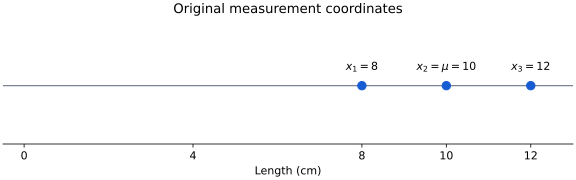
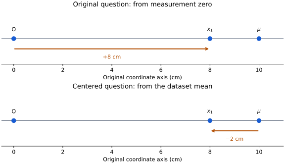
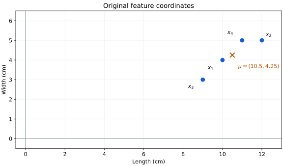
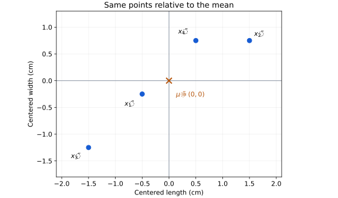
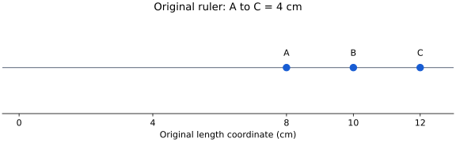
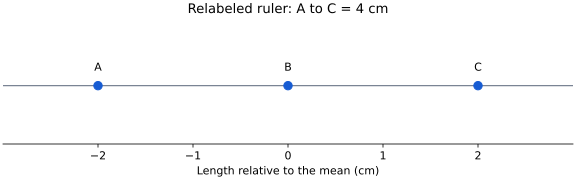
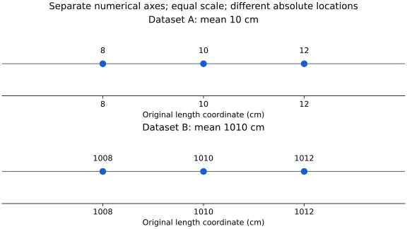
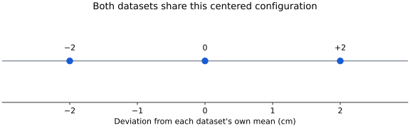

# Stage 4 — Part 2: What Centering Actually Changes, and What It Leaves Untouched

We have reached $\tilde{x}_i=x_i-\mu.$ It would be easy to memorize this as “centering means subtract the mean.” We will not do that. There is a more fundamental question:

> **If every observation changes numerically after centering, what exactly have we changed in the mathematical world? Did we change the observations, move the dataset, change the coordinate system, destroy information, or merely ask for a different relationship?**

This is worth resolving before variance because variance will be computed from these new objects `\tilde{x}_i`. If we do not know what they are, variance will become another formula without semantics.

## 1. Start with one dimension so nothing can hide

Take three measurements: $x_1=8,\qquad x_2=10,\qquad x_3=12.$ Suppose these are lengths in centimeters. Their mean is

$$
\mu=\frac{8+10+12}{3}=10.
$$

Originally, the observations are located at:



Their coordinates `8,10,12` answer:

> How far along the original length measurement axis is each observation from the original zero?

Now center them: $\tilde{x}_1=8-10=-2,$ $\tilde{x}_2=10-10=0,$ $\tilde{x}_3=12-10=2.$ So the new descriptions are: $-2,\quad0,\quad2.$ At first sight, it looks as though the data changed: $8\rightarrow-2,\qquad 10\rightarrow0,\qquad 12\rightarrow2.$ But consider the physical objects. The first component is still 8 cm long. Nothing physically became `-2` cm long. Therefore:

$$
\boxed{\tilde{x}_1=-2\text{ does not mean the object's length is }-2\text{ cm}.}
$$

It means:

$$
\boxed{\text{its length is }2\text{ cm below the dataset's mean length}.}
$$

The number changed because the **reference of the description changed**. That is our first major conclusion.

## 2. This is the same object described relative to a different reference

Before centering: $x_1=8$ means: $\text{measurement zero} \longrightarrow \text{observation}$ has signed amount `8`. After centering: $\tilde{x}_1=-2$ means: $\text{dataset mean} \longrightarrow \text{observation}$ has signed amount `-2`. Schematically:



We changed:

$$
\boxed{\text{reference}}
$$

and consequently changed:

$$
\boxed{\text{coordinate description}.}
$$

We did **not** change:

$$
\boxed{\text{the underlying measured observation}.}
$$

This should remind us directly of Stage 2: $[P]_O=5,\qquad [P]_{O'}=3$ could both describe the same point `P` relative to different origins. Centering is using that same conceptual machinery in feature space.

## 3. But there is a subtle semantic difference: $`x_i`$ and $`\tilde{x}_i`$ play different roles

Suppose:

$$
x_i= \begin{bmatrix} 12\\5 \end{bmatrix}
$$

and

$$
\mu= \begin{bmatrix} 10.5\\4.25 \end{bmatrix}.
$$

Then:

$$
\tilde{x}_i=x_i-\mu = \begin{bmatrix} 1.5\\0.75 \end{bmatrix}.
$$

The same array shape appears on both sides: $2\times1.$ A programming language might therefore give both objects the same low-level type:

```python
numpy.ndarray
```

But mathematically their **semantic types** differ. Think of something like:

```text
x_i:
    storage type = vector of 2 numbers
    semantic type = FeatureSpacePoint
    reference = original feature origin

μ:
    storage type = vector of 2 numbers
    semantic type = FeatureSpacePoint
    role = dataset center

x_i - μ:
    storage type = vector of 2 numbers
    semantic type = DisplacementFromDatasetCenter
    reference = μ
```

This distinction is critical. The expression $x_i-\mu$ takes two locations and asks for the directed difference between them. So there is a semantic type transition:

$$
\boxed{ \text{Point}-\text{Point} \rightarrow \text{Displacement}. }
$$

The notation does not visually announce that transition. We have to supply it mentally.

## 4. What does centering do to the whole dataset?

Return to:

$$
X= \begin{bmatrix} 10&4\\ 12&5\\ 9&3\\ 11&5 \end{bmatrix}
$$

with

$$
\mu= \begin{bmatrix} 10.5\\ 4.25 \end{bmatrix}.
$$

Center each observation:

$$
\tilde{x}_1= \begin{bmatrix} -0.5\\-0.25 \end{bmatrix}, \qquad \tilde{x}_2= \begin{bmatrix} 1.5\\0.75 \end{bmatrix},
$$

$$
\tilde{x}_3= \begin{bmatrix} -1.5\\-1.25 \end{bmatrix}, \qquad \tilde{x}_4= \begin{bmatrix} 0.5\\0.75 \end{bmatrix}.
$$

So:

$$
\tilde X= \begin{bmatrix} -0.5&-0.25\\ 1.5&0.75\\ -1.5&-1.25\\ 0.5&0.75 \end{bmatrix}.
$$

Look at what happened geometrically. Before:



After describing everything relative to `\mu`:



The point that used to have coordinates $\mu=(10.5,4.25)$ now corresponds to:

$$
\mu-\mu= \begin{bmatrix} 0\\0 \end{bmatrix}.
$$

So the dataset center becomes the new zero. That is the literal meaning of **centering**.

## 5. Did the arrangement of observations change?

This is where we can test whether centering merely changed reference or distorted the data. Before centering:

$$
x_2-x_1 = \begin{bmatrix} 12\\5 \end{bmatrix} - \begin{bmatrix} 10\\4 \end{bmatrix} = \begin{bmatrix} 2\\1 \end{bmatrix}.
$$

Now use the centered representations:

$$
\tilde{x}_2-\tilde{x}_1 = \begin{bmatrix} 1.5\\0.75 \end{bmatrix} - \begin{bmatrix} -0.5\\-0.25 \end{bmatrix}.
$$

Therefore:

$$
\tilde{x}_2-\tilde{x}_1 = \begin{bmatrix} 2\\1 \end{bmatrix}.
$$

Exactly the same displacement. Why? Use the definitions: $\tilde{x}_2=x_2-\mu, \qquad \tilde{x}_1=x_1-\mu.$ Then: $\tilde{x}_2-\tilde{x}_1 = (x_2-\mu)-(x_1-\mu).$ Expand: $=x_2-\mu-x_1+\mu.$ The common reference shift cancels: $=x_2-x_1.$ Therefore:

$$
\boxed{ \tilde{x}_j-\tilde{x}_i=x_j-x_i. }
$$

This is important enough to interpret rather than merely prove. Every observation was re-expressed relative to the **same new reference**. Therefore the relationship between any two observations remains unchanged.

## 6. A physical analogy: moving the ruler's zero

Imagine three marks on a ruler:



The separation between `A` and `C` is: $12-8=4.$ Now imagine relabeling `10` as our new zero:



The separation between `A` and `C` is still: $2-(-2)=4.$ The coordinate labels changed. The internal arrangement did not. That is exactly what centering does. This gives us an important distinction:

$$
\boxed{ \text{absolute location of the cloud changed relative to the coordinate origin} }
$$

but:

$$
\boxed{ \text{relative arrangement of points inside the cloud did not change}. }
$$

This is why centering is useful when our question concerns the **internal variation of the dataset rather than its absolute location**.

## 7. What information does centering retain?

Because: $\tilde{x}_i=x_i-\mu,$ if we retain `\mu`, then: $x_i=\tilde{x}_i+\mu.$ So:

```text
original observation
        |
        | subtract μ
        ↓
centered displacement
        |
        | add μ
        ↓
original observation
```

Nothing is irreversibly lost. The transformation is reversible as long as `\mu` is known. Therefore centering is **not dimensionality reduction**. It does not discard a feature. It does not collapse different observations together. It reorganizes the representation into:

$$
\boxed{ \text{dataset location} + \text{observation-specific displacement}. }
$$

Specifically:

$$
\boxed{ x_i=\mu+\tilde{x}_i. }
$$

This decomposition will become increasingly important.

## 8. But what if we throw away $`\mu`$?

Here we should distinguish the centered dataset from the complete information required to reconstruct the original coordinates. Suppose I give you only: $-2,\quad0,\quad2.$ Can you determine whether the original observations were: $8,\quad10,\quad12$ or: $98,\quad100,\quad102$ or: $998,\quad1000,\quad1002?$ No. All three datasets have the same centered representation: $-2,\quad0,\quad2.$ So centering alone deliberately removes the absolute dataset location from the centered coordinates. But that information has not mysteriously vanished from mathematics. It has been separated into `\mu`. Thus:

$$
\boxed{ \text{original dataset information} = \text{center location }\mu + \text{centered configuration }\tilde X. }
$$

If we retain both, reconstruction is exact. If we retain only `\tilde X`, we retain the dataset's relative configuration but lose its original absolute location. This is an excellent example of our retain/discard diagnostic.

## 9. Now we can understand why the centered observations sum to zero

For our centered dataset:

$$
\tilde{x}_1= \begin{bmatrix} -0.5\\-0.25 \end{bmatrix},
$$

$$
\tilde{x}_2= \begin{bmatrix} 1.5\\0.75 \end{bmatrix},
$$

$$
\tilde{x}_3= \begin{bmatrix} -1.5\\-1.25 \end{bmatrix},
$$

$$
\tilde{x}_4= \begin{bmatrix} 0.5\\0.75 \end{bmatrix}.
$$

Add them component by component. Length deviations: $-0.5+1.5-1.5+0.5=0.$ Width deviations: $-0.25+0.75-1.25+0.75=0.$ Therefore:

$$
\sum_{i=1}^{4}\tilde{x}_i = \begin{bmatrix} 0\\0 \end{bmatrix}.
$$

What does this mean? It does **not** mean that every observation has zero deviation. Clearly they do not. It means:

> Across the entire dataset, the signed deviations from the mean balance in every feature dimension.

For length, the total amount above the mean balances the total amount below it. For width, the same happens. Therefore:

$$
\boxed{ \frac1n\sum_i\tilde{x}_i=0. }
$$

The mean of the centered observations is the zero vector. This is exactly what we should expect because we deliberately made the old mean the new origin.

## 10. There are now two different meanings of "mean"

Before centering:

$$
\mu= \begin{bmatrix} 10.5\\4.25 \end{bmatrix}.
$$

This is the mean location under the original feature coordinates. After centering:

$$
\tilde{\mu}= \begin{bmatrix} 0\\0 \end{bmatrix}.
$$

Did the dataset's physical measurements suddenly acquire a different average? No. Again, the representation changed. Relative to the original feature origin: $\mu=(10.5,4.25).$ Relative to $`\mu`$ itself: $\tilde{\mu}=(0,0).$ So:

$$
\boxed{ \text{same center} \quad \text{different coordinate description under different reference}. }
$$

This is Stage 2 returning inside statistics.

## 11. Now we can finally read $`X - mean`$ semantically

Eventually in Python we will write something like:

```python
X_centered = X - mean
```

A beginner may read this operationally:

> NumPy subtracts one array from another.

We want to read it mathematically. Suppose:

```python
X.shape
# (4, 2)

mean.shape
# (2,)
```

Conceptually:

```text
X
=
4 observation locations
expressed using 2 feature coordinates

mean
=
1 dataset-center location
expressed using the same 2 feature coordinates
```

The desired mathematical operation is: $\tilde{x}_i=x_i-\mu$ for every observation `i`. So conceptually:

```text
observation 1 - dataset center → deviation 1
observation 2 - dataset center → deviation 2
observation 3 - dataset center → deviation 3
observation 4 - dataset center → deviation 4
```

or:

$$
\begin{bmatrix} x_1\\ x_2\\ x_3\\ x_4 \end{bmatrix} - \mu \quad\text{means}\quad \begin{bmatrix} x_1-\mu\\ x_2-\mu\\ x_3-\mu\\ x_4-\mu \end{bmatrix}.
$$

NumPy broadcasting will eventually provide a compact computational mechanism for expressing this repeated relationship. But the mathematical relationship comes first:

$$
\boxed{ \text{apply the same reference change to every observation}. }
$$

Broadcasting is merely how NumPy lets us encode it compactly.

## 12. Something deeper has happened to the dataset matrix

Before centering: $X_{ij}$ means:

> absolute measured value of feature `j` for observation `i`.

After centering: $\tilde X_{ij}=X_{ij}-\mu_j$ means:

> signed deviation of observation `i`'s feature `j` from the dataset mean of feature `j`.

This is a major semantic transformation. Same matrix shape: $n\times d.$ Same row/column structure. But different meaning of every entry. Before:

$$
\boxed{\text{feature value}}
$$

After:

$$
\boxed{\text{feature deviation from dataset center}}.
$$

This is exactly the sort of silent type change that mathematical notation often hides.

## 13. Why this transformation is necessary before studying variation

Now suppose the length values are: $1008,\quad1010,\quad1012.$ Their mean is: $1010.$ The centered values are: $-2,\quad0,\quad2.$ Now compare another dataset: $8,\quad10,\quad12.$ Its mean is: $10.$ Its centered values are also: $-2,\quad0,\quad2.$ The two datasets occupy very different absolute locations:



But their internal pattern of variation is identical. Both have:



So if our question is:

> How much and in what pattern do observations vary around their own typical location?

then the difference between `10` and `1010` is irrelevant to that question. Centering isolates the structure we actually want to study. This gives us the intellectual transition into Stage 5.

## 14. But a new problem immediately appears

After centering, suppose we have: $-2,\quad0,\quad2.$ We know every observation's deviation individually. But now suppose we want **one number** answering:

> How spread out is this collection around its center?

Could we simply average the deviations? Let's try:

$$
\frac{-2+0+2}{3}=0.
$$

Now consider a completely different dataset: $-100,\quad0,\quad100.$ Its average deviation is also:

$$
\frac{-100+0+100}{3}=0.
$$

And a dataset with no variation: $0,\quad0,\quad0$ also has average deviation: $0.$ We have encountered a genuine limitation. Three radically different spreads: $[-2,0,2],$ $[-100,0,100],$ and $[0,0,0]$ all produce the same average signed deviation: $0.$ Why? Because the mean was specifically constructed so that positive and negative deviations balance. Therefore ordinary averaging of signed deviations destroys exactly the information we now want:

$$
\boxed{\text{amount of variation}.}
$$

This is not an accident. It is the next problem mathematics has to solve. We now possess the right objects: $\tilde{x}_i=x_i-\mu.$ They tell us **how each observation differs from the center**. What we do not yet possess is a way to transform those signed deviations so that opposite directions do not cancel while still preserving information about **how large the deviations are**. That is the constructive problem from which **variance** must emerge in Stage 5.

## Python companion and figure source

[Open the companion Python file](https://github.com/hafizarslanamjad/pca-from-first-principles/blob/main/examples/12_centering_reference_change.py) · [Open the Python plotting script](https://github.com/hafizarslanamjad/pca-from-first-principles/blob/main/examples/12_centering_figures.py)

The supplementary companion reuses the earlier centering types and compares their row-by-row results with NumPy broadcasting. It checks retained pairwise displacements, reconstruction with the mean, and different spreads with the same zero signed average. The plotting script regenerates the figures from the stated numerical coordinates. Floating-point checks use tolerances; the lecture's exact algebra is not a guarantee of exact recovery for every float input.

```{python}
#| echo: false
from pathlib import Path
import runpy

_ = runpy.run_path(
    str(Path("examples/12_centering_reference_change.py")),
    run_name="__main__",
)
```
