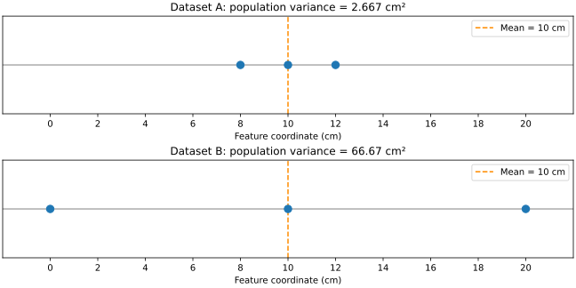

# Stage 5 — Part 1: Why “Average Deviation” Fails, and What Problem Variance Is Trying to Solve

We are now at a very precise problem. After centering, each observation has become a **deviation from the dataset center**: $\tilde x_i=x_i-\mu.$ For one feature, suppose the centered values are: $-2,\quad 0,\quad 2.$ Each number has a clear meaning. The first observation is 2 units below the mean, the second is exactly at the mean, the third is 2 units above the mean. So far, everything is observation-specific. Now our question changes again:

> **Can we summarize the overall amount of variation in the dataset with one number?**

That is a new scope. We are no longer asking where one observation lies relative to the mean. We are asking for a **dataset-level property**. This distinction matters: $\tilde x_i$ is an observation-specific deviation. But something like $\text{variance}$ will be a property of the collection. The first question is therefore not “what is the variance formula?” It is:

> **What information from all the deviations must survive if we compress them into one number?**

## 1. What should a measure of spread be able to distinguish?

Consider three centered datasets. Dataset A: $[-2,0,2]$ Dataset B: $[-100,0,100]$ Dataset C: $[0,0,0].$ Their meanings are very different. Dataset C has no variation at all. Dataset A has moderate variation. Dataset B has enormous variation. So whatever scalar we invent should somehow preserve this ordering:

$$
\boxed{ \text{spread}(C) < \text{spread}(A) < \text{spread}(B) }
$$

Now try the simplest idea:

$$
\text{average deviation} = \frac{1}{n}\sum_i \tilde x_i.
$$

For Dataset A:

$$
\frac{-2+0+2}{3}=0.
$$

For Dataset B:

$$
\frac{-100+0+100}{3}=0.
$$

For Dataset C:

$$
\frac{0+0+0}{3}=0.
$$

All three produce: $0.$ So this operation completely fails at the job we assigned it. Why? Not because averaging is a bad operation in general. Because the **sign of a deviation encodes direction**, while the question “how much spread is there?” is not asking whether deviations are positive or negative. It is asking how large they are. Positive and negative deviations cancel because addition preserves sign. That cancellation destroys the very information we now care about. So we have discovered the exact limitation:

$$
\boxed{ \text{signed deviations contain two pieces of information: direction and amount} }
$$

but our new question needs mainly:

$$
\boxed{ \text{amount of departure from the center}. }
$$

This is a semantic mismatch between the object we have and the property we want to extract.

## 2. We need to separate direction from size

Take one deviation: $\tilde x=-7.$ What does `-7` contain? It tells us two things:

- the observation lies on the negative side of the mean;
- its displacement from the mean has size 7.

So, conceptually:

$$
\boxed{ \text{deviation} = \text{direction relative to mean} + \text{amount away from mean} }
$$

For a one-dimensional signed number, the sign gives direction and the magnitude gives size. If our question is:

> How spread out are the observations?

then the sign may no longer be the information we need. We need a transformation that says:

> Ignore which side of the mean the observation lies on; retain how far away it is.

That suggests: $|-7|=7, \qquad |7|=7.$ Now opposite deviations become comparable by size. This gives us a first candidate.

## 3. Why not just use absolute deviations?

Take: $[-2,0,2].$ Absolute deviations: $[2,0,2].$ Average:

$$
\frac{2+0+2}{3} = \frac{4}{3}.
$$

Now for: $[-100,0,100],$ absolute deviations: $[100,0,100],$ average:

$$
\frac{200}{3}.
$$

And for: $[0,0,0],$ average: $0.$ This works in an important sense. It distinguishes the three spreads correctly. So mathematics did not have only one possible path. The quantity

$$
\frac1n\sum_i |\tilde x_i|
$$

is meaningful. It is a genuine measure of spread. Later you may encounter it as **mean absolute deviation**. So why did variance become so central instead? Because mathematics often chooses an operation not only because it answers the immediate question, but because of what structures it interacts with later. That is where squaring enters. We should derive its role carefully.

## 4. What does squaring do to a signed deviation?

Take: $\tilde x=-3.$ Square it: $(-3)^2=9.$ Take: $\tilde x=3.$ Square it: $3^2=9.$ So squaring removes the directional sign: $-3,\,+3 \quad\longrightarrow\quad 9,\,9.$ But it does more than that. Compare: $1^2=1,$ $2^2=4,$ $3^2=9,$ $10^2=100.$ Larger deviations receive disproportionately larger values. So squaring performs two semantic transformations at once:

$$
\boxed{ \text{signed deviation} \rightarrow \text{nonnegative size-related quantity} }
$$

and

$$
\boxed{ \text{larger deviations receive greater emphasis}. }
$$

That second property will become important in statistics, geometry, optimization, and PCA.

## 5. But what kind of thing is $`(x_i-\mu)^2`$?

This is where we should not casually say “distance squared” and move on. Suppose: $x_i-\mu=3\text{ cm}.$ Then: $(x_i-\mu)^2=9\text{ cm}^2.$ This does **not** mean the observation has moved into an area. The square is not a new physical measurement like area. It is a mathematically constructed quantity used to encode the size of deviation in a way that removes sign and emphasizes larger deviations. So:

$$
\boxed{ (x_i-\mu)^2 }
$$

is not the original deviation. It is a transformed measure derived from that deviation. It retains:

- information about how large the deviation is;
- stronger sensitivity to larger deviations.

It discards:

- the direction/sign of the deviation.

That retain/discard distinction is central.

## 6. Build the idea with one dataset

Take: $x=[8,10,12].$ Mean: $\mu=10.$ Deviations: $[-2,0,2].$ Squared deviations: $[4,0,4].$ Now ask:

> If we want one number summarizing the typical squared departure from the mean, what should we do?

Average them:

$$
\frac{4+0+4}{3} = \frac83.
$$

That quantity is:

$$
\boxed{ \frac1n\sum_i (x_i-\mu)^2 }
$$

and this is the population variance. But notice the order of invention: $\text{absolute observations}$ became $\text{deviations from a shared reference}$ then we discovered that signed deviations cancel when aggregated, so we transformed them into nonnegative squared deviations, then averaged those transformed deviations to obtain one dataset-level quantity. Thus:

$$
\boxed{ \text{variance} = \text{average squared deviation from the mean}. }
$$

This definition is compact, but now each word has a role.

## 7. Parse the variance formula by semantic type

Write:

$$
\sigma^2 = \frac1n \sum_{i=1}^n (x_i-\mu)^2.
$$

Do not read it as one block. Start inside.

### $`x_i`$

One observation's feature value. Semantic type: $\text{PointOnFeatureAxis}$

### $`\mu`$

Dataset mean for that feature. Semantic type: $\text{DatasetReferencePoint}$

### $`x_i-\mu`$

Signed displacement of observation `i` from the mean. Semantic type: $\text{Deviation}$

### $`(x_i-\mu)^2`$

Nonnegative squared amount derived from that deviation. Semantic type: $\text{SquaredDeviation}$

### $`\sum_i (x_i-\mu)^2`$

Total squared deviation contributed by all observations. Semantic type: $\text{TotalSquaredVariation}$

### $`\frac1n\sum_i (x_i-\mu)^2`$

Average squared deviation per observation. Semantic type: $\text{DatasetLevelSpreadMeasure}$ And that final object is variance. So the formula performs a sequence of semantic transformations:

$$
\boxed{ \text{location} \rightarrow \text{deviation} \rightarrow \text{squared deviation} \rightarrow \text{total} \rightarrow \text{average spread}. }
$$

## 8. Why does variance equal zero only when there is no variation?

Suppose: $\sigma^2=0.$ Variance is an average of squared deviations: $(x_i-\mu)^2.$ Every squared deviation is nonnegative. Therefore the only way their average can be zero is if every one of them is zero: $(x_i-\mu)^2=0$ for every `i`. Hence: $x_i-\mu=0,$ so: $x_i=\mu$ for every observation. Thus:

$$
\boxed{ \sigma^2=0 \iff \text{every observation is at the same location}. }
$$

This is exactly what a measure of spread should do. Zero variance means no variation.

## 9. Compare two datasets numerically

Dataset A: $[8,10,12].$ Mean: $10.$ Squared deviations: $4,0,4.$ Variance:

$$
\frac83\approx2.67.
$$

Dataset B: $[0,10,20].$ Mean is still: $10.$ Squared deviations: $100,0,100.$ Variance:

$$
\frac{200}{3}\approx66.67.
$$

Notice something important. Both datasets have the same mean: $10.$ So the mean alone cannot distinguish them. Their **location** is the same. Their **variation around that location** is different. This is our first clean separation between:

$$
\boxed{\text{center}}
$$

and

$$
\boxed{\text{spread around center}}.
$$

Mean and variance answer different questions.

## 10. Why variance is not “the average distance”

This terminology matters. Suppose variance is:

$$
\frac83\text{ cm}^2.
$$

This is not a typical distance in centimeters. Its units are squared. So variance answers something closer to:

> What is the average squared deviation from the center?

not:

> How many centimeters away is a typical observation?

If we want to return to the original units, we can later take: $\sqrt{\sigma^2}.$ This produces the standard deviation. But we should not introduce standard deviation merely as “square root of variance.” Its need is straightforward: variance has squared units, and sometimes we want a spread summary expressed in the same units as the original measurement. For now, variance itself is the important object because squared quantities interact especially well with geometry and later with covariance and PCA.

## 11. Why squaring will matter much more in multiple dimensions

This is the deeper reason we should not stop at “squaring prevents cancellation.” In one dimension, absolute value could also prevent cancellation. But soon our deviations will be vectors:

$$
\tilde x_i= \begin{bmatrix} \tilde x_{i1}\\ \tilde x_{i2} \end{bmatrix}.
$$

Then squared lengths naturally appear: $\|\tilde x_i\|^2 = \tilde x_{i1}^2+\tilde x_{i2}^2.$ And later, when we ask how two features deviate together, products like $\tilde x_{i1}\tilde x_{i2}$ will appear. Those products will lead to covariance. So squaring is not an isolated trick. It belongs to a larger mathematical structure based on products of deviations. That structure is what PCA will eventually exploit.

## 12. One subtle point: variance is a property of a chosen feature

Suppose our dataset has length and width. For length we may compute: $\operatorname{Var}(\text{length}).$ For width: $\operatorname{Var}(\text{width}).$ These are two different dataset-level quantities. Variance does not yet describe the relationship between length and width. It describes how one feature varies around its own mean. So:

$$
\boxed{ \text{variance} = \text{self-variation of one feature}. }
$$

Later covariance will ask:

> When length deviates, how does width tend to deviate with it?

That is a genuinely new relationship. We should not jump there until variance is semantically stable.

## 13. The full constructive chain so far

We can now reconstruct the entire path from raw observation to variance: $\text{observation value }x_i$ asks:

> where is this observation in the original feature coordinates?

Then: $x_i-\mu$ asks:

> how is this observation displaced from the dataset center?

Then: $(x_i-\mu)^2$ asks:

> how large is that deviation in a sign-independent squared sense?

Then:

$$
\sum_i(x_i-\mu)^2
$$

asks:

> how much total squared deviation exists across the dataset?

Then:

$$
\frac1n\sum_i(x_i-\mu)^2
$$

asks:

> what is the average squared deviation per observation?

That final quantity is variance. The formula is therefore not one mysterious operation. It is a pipeline of semantic transformations.

## 14. Stage 5 checkpoint

The key distinction at this stage is:

$$
\boxed{ \text{deviation} \neq \text{variance}. }
$$

A deviation belongs to one observation: $x_i-\mu.$ Variance belongs to the dataset:

$$
\frac1n\sum_i(x_i-\mu)^2.
$$

And the critical limitation that forced variance to emerge was:

$$
\boxed{ \text{signed deviations cancel, so direct averaging cannot measure spread}. }
$$

Squaring was introduced because it converts signed deviations into nonnegative, size-sensitive contributions that can be aggregated. The next Stage 5 step should stay with this question and examine **why squaring rather than absolute value became so structurally powerful**, especially how the identity $a^2+b^2$ connects deviation magnitude, Euclidean geometry, dot products, and the later covariance machinery. That will prepare us for Stage 6 without turning variance into a memorized statistic.

## Python companion and numerical figure

[Open the companion Python file](https://github.com/hafizarslanamjad/pca-from-first-principles/blob/main/examples/13_average_deviation_and_variance.py) · [Open the plotting script](https://github.com/hafizarslanamjad/pca-from-first-principles/blob/main/examples/13_variance_figures.py)

This supplementary implementation treats one chosen feature axis in centimeters, including zero and signed coordinates. It distinguishes coordinates, a mean, deviations, squared deviations, mean absolute deviation, and population variance through semantic annotations. Annotations do not enforce units at runtime; the function validates finite inputs and rejects unrepresentable squared results. The divisor is $n$, as in the lecture, rather than the $n-1$ used for a different estimation question. Floating-point results are approximate.



```{python}
#| echo: false
from pathlib import Path
import runpy

_ = runpy.run_path(
    str(Path("examples/13_average_deviation_and_variance.py")),
    run_name="__main__",
)
```

In the conceptual direction-plus-amount box, the plus sign lists two pieces of information; it is not numerical addition. In the later multidimensional preview, the displayed Euclidean squared-length relationship assumes perpendicular, equally scaled axes with compatible units. These implementation notes leave the supplied notation unchanged.
