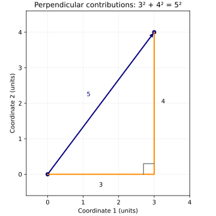
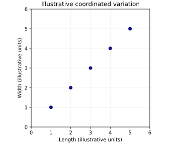

# Stage 5 — Part 2: Why Squaring Becomes So Powerful

We already know one immediate reason for squaring deviations: $-3 \mapsto 9,\qquad 3\mapsto 9$ so opposite directions no longer cancel. But that alone does not explain why squared quantities become central in statistics, geometry, optimization, covariance, and eventually PCA. To understand that, we need to see that squaring is not just a sign-removal trick. It connects naturally to **magnitude**, **orthogonal decomposition**, and **dot products**.

## 1. Start with one deviation

Suppose an observation lies 3 cm above the mean: $\tilde x = 3.$ Its squared deviation is $\tilde x^2 = 9.$ Now suppose another lies 4 cm above the mean: $\tilde x=4.$ Its squared deviation is $16.$ So larger deviations contribute more strongly. That much is familiar. But now consider a deviation in two dimensions:

$$
\tilde x= \begin{bmatrix} 3\\ 4 \end{bmatrix}.
$$

This means:

- 3 units of deviation along feature direction 1,
- 4 units of deviation along feature direction 2.

The question becomes:

> How large is this whole deviation vector?

From geometry: $\|\tilde x\| = \sqrt{3^2+4^2} = 5.$ Therefore: $\|\tilde x\|^2 = 3^2+4^2 = 25.$ This is the first major structural connection:

$$
\boxed{ \text{squared magnitude of a vector} = \text{sum of squared coordinate contributions} }
$$

provided those coordinates belong to an appropriate Euclidean coordinate system.

## 2. Why addition of squares appears

Take the vector

$$
v= \begin{bmatrix} 3\\ 4 \end{bmatrix}.
$$

Its components are perpendicular directional contributions. Visually:



The horizontal contribution has size 3. The vertical contribution has size 4. The total displacement has size 5. The Pythagorean relationship is $5^2=3^2+4^2.$ So the squares do something important:

> They allow independent perpendicular contributions to combine additively into total squared magnitude.

That is much deeper than simply removing negative signs.

## 3. This gives squared quantities a decomposition property

Suppose $v=a e_1+b e_2$ where $e_1,e_2$ are perpendicular unit directions. Then $\|v\|^2=a^2+b^2.$ This means total squared magnitude can be decomposed into:

$$
\boxed{ \text{squared contribution along direction 1} + \text{squared contribution along direction 2}. }
$$

That decomposition will become extremely useful later. PCA will eventually ask:

> How much of the dataset's variation is visible along one direction?

and:

> How much remains along another direction?

Squared quantities allow those directional contributions to be handled cleanly.

## 4. Why absolute value does not give the same geometry

Suppose again:

$$
v= \begin{bmatrix} 3\\ 4 \end{bmatrix}.
$$

If we tried to define its size using absolute values: $|3|+|4|=7.$ That is a legitimate quantity. It defines a different notion of distance. But it does not give the ordinary straight-line distance between the starting and ending points. The Euclidean distance is: $5.$ So different transformations answer different questions. Absolute value supports one geometry. Squaring and square roots support another. PCA is built on Euclidean geometry, so squared quantities fit its structure naturally.

## 5. Squaring also interacts cleanly with multiplication

Now take a scalar $c$ and vector $v$. If:

$$
v= \begin{bmatrix} 3\\ 4 \end{bmatrix},
$$

then:

$$
2v= \begin{bmatrix} 6\\ 8 \end{bmatrix}.
$$

Original magnitude: $\|v\|=5.$ New magnitude: $\|2v\|=10.$ Squared magnitudes: $\|v\|^2=25,$ $\|2v\|^2=100.$ And: $100=2^2\cdot25.$ So:

$$
\boxed{ \|cv\|^2=c^2\|v\|^2. }
$$

This scaling rule is simple and algebraically convenient. That matters because PCA will repeatedly scale, project, and compare directions.

## 6. Where dot product enters

For a vector

$$
v= \begin{bmatrix} 3\\ 4 \end{bmatrix},
$$

compute: $v^Tv.$ This gives:

$$
[3\quad4] \begin{bmatrix} 3\\ 4 \end{bmatrix} = 3^2+4^2 = 25.
$$

So:

$$
\boxed{ v^Tv=\|v\|^2. }
$$

This is a fundamental identity. The squared magnitude of a vector can be written as a dot product of the vector with itself. That is why squared geometry fits so naturally into matrix algebra. Instead of repeatedly writing: $v_1^2+v_2^2+\cdots+v_d^2,$ we can write: $v^Tv.$

## 7. But what does $v^Tv$ mean semantically?

Do not read it merely as matrix multiplication. The vector $v$ contains directional coordinate contributions. The dot product with itself combines matching coordinates multiplicatively and then adds:

$$
v^Tv = \sum_j v_jv_j = \sum_j v_j^2.
$$

Each coordinate contributes its squared amount. Then those squared contributions are aggregated. So:

$$
\boxed{ v^Tv = \text{total squared magnitude represented across the coordinates}. }
$$

This is one reason dot products become central in geometry.

## 8. Return to a centered observation

Suppose:

$$
\tilde x_i= \begin{bmatrix} 1.5\\ 0.75 \end{bmatrix}.
$$

This is a displacement from the dataset mean. Then: $\tilde x_i^T\tilde x_i = 1.5^2+0.75^2.$ Calculate: $2.25+0.5625=2.8125.$ So:

$$
\boxed{ \tilde x_i^T\tilde x_i = \|\tilde x_i\|^2. }
$$

Semantically:

> This gives the squared magnitude of observation $i$'s displacement from the dataset center.

That is now a whole-observation measure rather than a single-feature deviation.

## 9. But variance is still feature-specific

Be careful here. For one feature:

$$
\operatorname{Var}(x_j) = \frac1n\sum_i (x_{ij}-\mu_j)^2.
$$

This asks:

> How much does feature $j$ vary across observations?

By contrast: $\|\tilde x_i\|^2$ asks:

> How far is observation $i$ from the dataset center across all feature dimensions together?

These are different axes of aggregation. One holds feature fixed and varies observation index. The other holds observation fixed and combines feature contributions. This distinction will matter enormously when we form the covariance matrix.

## 10. A matrix viewpoint begins to emerge

Suppose the centered data matrix is:

$$
\tilde X= \begin{bmatrix} -0.5&-0.25\\ 1.5&0.75\\ -1.5&-1.25\\ 0.5&0.75 \end{bmatrix}.
$$

Look at the first column:

$$
\begin{bmatrix} -0.5\\ 1.5\\ -1.5\\ 0.5 \end{bmatrix}.
$$

This column contains length deviations across observations. Squaring and averaging gives length variance. Look at the second column:

$$
\begin{bmatrix} -0.25\\ 0.75\\ -1.25\\ 0.75 \end{bmatrix}.
$$

Squaring and averaging gives width variance. So each variance is essentially a column interacting with itself. That should already suggest a pattern:

$$
\boxed{ \text{feature with itself} \rightarrow \text{variance}. }
$$

The natural next question is:

> What happens if one feature interacts with another feature instead of with itself?

That is exactly where covariance comes from.

## 11. Why products of deviations appear naturally

Suppose for one observation: $\tilde x_{i1}=2$ and $\tilde x_{i2}=3.$ Both are positive. Their product is: $2\cdot3=6.$ Now suppose: $\tilde x_{i1}=-2,\qquad \tilde x_{i2}=-3.$ Their product is again: $(-2)(-3)=6.$ So when both features deviate in the same directional sense relative to their means, the product is positive. But if: $\tilde x_{i1}=2,\qquad \tilde x_{i2}=-3,$ then: $2(-3)=-6.$ Now the deviations point in opposite signs relative to their respective means. This is already giving us information about **coordinated variation**. Squaring is simply the special case where a feature is multiplied by itself: $\tilde x_{ij}\tilde x_{ij} = \tilde x_{ij}^2.$ That means variance is structurally a special kind of deviation-product relationship.

## 12. This is the bridge to covariance

For one feature $j$:

$$
\operatorname{Var}(x_j) = \frac1n\sum_i \tilde x_{ij}\tilde x_{ij}.
$$

For two different features $j$ and $k$:

$$
\frac1n\sum_i \tilde x_{ij}\tilde x_{ik}.
$$

The first asks:

> How strongly does feature $j$ vary with itself?

The second asks:

> How do feature $j$ and feature $k$ vary together?

This second quantity becomes covariance. So variance and covariance are not unrelated formulas. They belong to one common structure:

$$
\boxed{ \text{average product of centered deviations}. }
$$

When the two features are the same: $j=k$ we get variance. When they differ: $j\neq k$ we get covariance. That is why earlier I called variance “self-covariance.” Now the phrase has a constructive meaning.

## 13. Why this matters for PCA

PCA is not merely interested in: $\text{how much length varies}$ or: $\text{how much width varies}.$ It will eventually ask whether combinations of features vary strongly together. Imagine data roughly arranged like:



Length and width are not varying independently. As length increases, width tends to increase too. That joint structure is invisible if we only know two separate variances. We need information about how the features deviate together. That is what covariance provides.

## 14. Semantic audit of squaring

Take: $(x_i-\mu)^2.$ **Object before operation:** signed deviation from the mean. **Reference:** dataset mean. **Operation:** multiply the deviation by itself. **What is retained?** Size information, with stronger emphasis on large deviations. **What is discarded?** Directional sign. **What does the result mean?** A squared contribution to variation. Now take: $\tilde x_i^T\tilde x_i.$ **Object:** full deviation vector of one observation. **Operation:** dot product with itself. **What is retained?** Total squared magnitude of the displacement across Euclidean feature directions. **What is discarded?** Direction of the displacement as a whole. **Result:** one scalar describing squared distance from the dataset center.

## 15. The conceptual chain has now extended

We had: $x_i$ absolute observation location. Then: $x_i-\mu$ deviation from dataset center. Then: $(x_i-\mu)^2$ squared contribution to variation for one feature. Then:

$$
\frac1n\sum_i(x_i-\mu)^2
$$

variance of that feature. Now we have discovered the broader pattern:

$$
\boxed{ \text{deviation}\times\text{deviation} }
$$

can encode relationships between variations. Self-product: $\tilde x_{ij}^2$ measures self-variation contribution. Cross-product: $\tilde x_{ij}\tilde x_{ik}$ measures coordinated directional contribution between two features. That is the exact conceptual doorway into Stage 6: **relationships among features and the invention of covariance**.

## Python companion and figure source

[Open the companion Python file](https://github.com/hafizarslanamjad/pca-from-first-principles/blob/main/examples/14_why_squaring_becomes_powerful.py) · [Open the plotting script](https://github.com/hafizarslanamjad/pca-from-first-principles/blob/main/examples/14_squaring_figures.py)

The companion reuses the existing typed length-width observations and signed deviations. It keeps per-observation squared magnitudes separate from feature-level variances and the mean length-width deviation product. These examples explicitly choose perpendicular, equally scaled feature axes with centimeter units; this feature-space metric is not automatically a physical displacement metric. In the supplied matrix notation, $v$ and $\tilde x_i$ are written directly as coordinate columns in that fixed frame, so transposes act on those representations. Static annotations document roles; runtime checks reject nonfinite or unrepresentable products, and floating-point rounding still applies. Population averages use divisor $n$.

```{python}
#| echo: false
from pathlib import Path
import runpy

_ = runpy.run_path(
    str(Path("examples/14_why_squaring_becomes_powerful.py")),
    run_name="__main__",
)
```
