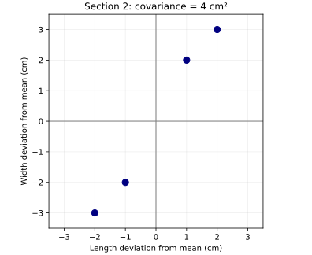
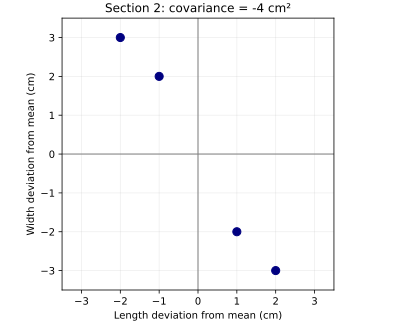

# Stage 6 — Part 1: From Individual Variation to Relationships Between Features

Until now, we have asked a one-feature question:

> How much does this feature vary around its mean?

That gave us variance. But a dataset with multiple features contains another kind of information that variance cannot capture:

> **Do two features tend to depart from their means together?**

This is a different question. It is not about how much one feature varies by itself. It is about a **relationship between two patterns of deviation**. We should construct that need carefully before naming covariance.

## 1. Start with two features

Suppose our observations have: $x_1=\text{length}$ and $x_2=\text{width}.$ For each observation $i$, after centering we have: $\tilde x_{i1}=x_{i1}-\mu_1$ and $\tilde x_{i2}=x_{i2}-\mu_2.$ These two numbers answer:

> How far is this observation's length from mean length?

and

> How far is this observation's width from mean width?

For one observation we might get:

$$
\tilde x_i= \begin{bmatrix} 2\\ 3 \end{bmatrix}.
$$

This means:

- length is 2 units above its mean,
- width is 3 units above its mean.

Now another observation might have:

$$
\tilde x_i= \begin{bmatrix} -2\\ -4 \end{bmatrix}.
$$

This means:

- length is below its mean,
- width is also below its mean.

A pattern is beginning to appear. When one feature is above its mean, the other also tends to be above. When one is below, the other also tends to be below. That is not a property of either feature alone. It is a property of their **coordinated behavior**.

## 2. Why separate variances cannot reveal this

Imagine two datasets. Dataset A:

```text
length deviation    width deviation
      -2                  -3
      -1                  -2
       1                   2
       2                   3
```

Dataset B:

```text
length deviation    width deviation
      -2                   3
      -1                   2
       1                  -2
       2                  -3
```

The length deviations are the same in both datasets. The width deviations have the same magnitudes in both datasets. Therefore the variance of length can be the same. The variance of width can also be the same. But the relationship is completely different. In Dataset A: $\text{length above mean} \Rightarrow \text{width above mean}.$ In Dataset B: $\text{length above mean} \Rightarrow \text{width below mean}.$ So knowing only $\operatorname{Var}(x_1)$ and $\operatorname{Var}(x_2)$ cannot tell these situations apart. We have discovered a missing kind of information.

## 3. What kind of operation could detect coordinated direction?

For one observation, suppose: $\tilde x_{i1}=2, \qquad \tilde x_{i2}=3.$ Both are positive. We want some operation that records:

> same directional side of their respective means.

Multiplication gives: $2\cdot3=6.$ Positive. Now suppose: $\tilde x_{i1}=-2, \qquad \tilde x_{i2}=-3.$ Both are negative. Then: $(-2)(-3)=6.$ Again positive. So the product treats these two cases similarly: $(+,+)\rightarrow +$ $(-,-)\rightarrow +.$ That is exactly what we need if “moving together” means both are on the same side of their means. Now suppose: $\tilde x_{i1}=2, \qquad \tilde x_{i2}=-3.$ Then: $2(-3)=-6.$ And: $(-2)(3)=-6.$ So: $(+,-)\rightarrow -$ $(-,+)\rightarrow -.$ Therefore the sign of the product encodes an important relationship:

$$
\boxed{ \tilde x_{i1}\tilde x_{i2}>0 \Rightarrow \text{same-sided deviations} }
$$

$$
\boxed{ \tilde x_{i1}\tilde x_{i2}<0 \Rightarrow \text{opposite-sided deviations} }
$$

This is why multiplication naturally appears. It is not an arbitrary statistical convention. The sign behavior of multiplication matches the relationship we want to detect.

## 4. What does the magnitude of the product tell us?

Suppose: $\tilde x_{i1}=0.1, \qquad \tilde x_{i2}=0.2.$ Then: $0.1\cdot0.2=0.02.$ Now compare: $\tilde x_{i1}=10, \qquad \tilde x_{i2}=20.$ Then: $10\cdot20=200.$ Both observations show same-sided deviations. But the second observation contributes much more strongly because both deviations are large. So the product encodes two things at once:

$$
\boxed{ \text{sign} \rightarrow \text{same/opposite directional relationship} }
$$

and

$$
\boxed{ \text{magnitude} \rightarrow \text{strength of joint departure for that observation}. }
$$

That is a very useful constructed quantity.

## 5. One product is still only one observation

For observation $i$, define: $c_i= \tilde x_{i1}\tilde x_{i2}.$ This tells us about coordinated deviation for **one observation**. But our question is dataset-level:

> Across the whole dataset, how do these two features tend to vary together?

So once again we have to aggregate across observations. That gives:

$$
\frac1n \sum_{i=1}^n \tilde x_{i1}\tilde x_{i2}.
$$

Now we can name this quantity. It is the covariance between features 1 and 2:

$$
\boxed{ \operatorname{Cov}(x_1,x_2) = \frac1n \sum_{i=1}^n (x_{i1}-\mu_1)(x_{i2}-\mu_2) }
$$

for the population form. The formula is compact, but the semantic chain is: $\text{feature values} \rightarrow \text{deviations} \rightarrow \text{pairwise deviation products} \rightarrow \text{average joint behavior}.$

## 6. Interpret positive covariance

Suppose: $\operatorname{Cov}(x_1,x_2)>0.$ What does this mean? Across observations, products like $\tilde x_{i1}\tilde x_{i2}$ tend to be positive strongly enough to dominate negative products. That usually means observations often behave like: $(+,+)$ or $(-,-).$ So:

> when feature 1 is above its mean, feature 2 tends also to be above its mean; when feature 1 is below its mean, feature 2 tends also to be below its mean.

Geometrically, the cloud tends to have a positive diagonal orientation:



This is positive coordinated variation.

## 7. Interpret negative covariance

If: $\operatorname{Cov}(x_1,x_2)<0,$ then opposite-sign products tend to dominate. So observations often behave like: $(+,-)$ or $(-,+).$ Geometrically:



As feature 1 increases relative to its mean, feature 2 tends to decrease relative to its mean. That produces negative covariance.

## 8. What does covariance near zero mean?

Suppose: $\operatorname{Cov}(x_1,x_2)\approx0.$ This means the signed products balance approximately. But we must be careful. It does **not** necessarily mean:

> the features have no relationship whatsoever.

It means:

> this particular measure of linear coordinated deviation is weak or balanced.

For example, a curved relationship can have covariance near zero. That distinction will matter later. So covariance is specifically about a certain kind of linear joint variation.

## 9. Why centering had to come first

Suppose we ignored the means and multiplied raw feature values directly: $x_{i1}x_{i2}.$ Then large absolute baselines could dominate the product. Example: $x_{i1}=1002,\qquad x_{i2}=1003.$ The raw product is huge. But perhaps their means are: $\mu_1=1000,\qquad\mu_2=1000.$ Then the actual deviations are only: $2,\qquad3.$ The relationship we care about is: $2\cdot3=6,$ not: $1002\cdot1003.$ Centering removes the common baseline and isolates the coordinated departures. So:

$$
\boxed{ \text{covariance studies co-deviation around feature means} }
$$

not raw magnitude. This is exactly why Stage 4 had to exist before Stage 6.

## 10. Variance is now revealed as a special case

Take the covariance formula:

$$
\operatorname{Cov}(x_j,x_k) = \frac1n\sum_i \tilde x_{ij}\tilde x_{ik}.
$$

Now set: $j=k.$ Then:

$$
\operatorname{Cov}(x_j,x_j) = \frac1n\sum_i \tilde x_{ij}\tilde x_{ij}.
$$

Therefore:

$$
= \frac1n\sum_i\tilde x_{ij}^2.
$$

But that is variance:

$$
\boxed{ \operatorname{Cov}(x_j,x_j) = \operatorname{Var}(x_j). }
$$

This is not merely a formula identity. It tells us something structural. Variance asks:

> How does this feature vary with itself?

Covariance asks:

> How do two features vary together?

So covariance is the broader relationship. Variance sits inside it as the self-relationship case.

## 11. A concrete dataset

Take centered observations:

$$
\tilde X= \begin{bmatrix} -2&-3\\ -1&-1\\ 1&2\\ 2&2 \end{bmatrix}.
$$

The first column is feature 1 deviation: $[-2,-1,1,2].$ The second column is feature 2 deviation: $[-3,-1,2,2].$ Multiply corresponding deviations: $(-2)(-3)=6,$ $(-1)(-1)=1,$ $(1)(2)=2,$ $(2)(2)=4.$ All products are positive. Their average:

$$
\frac{6+1+2+4}{4} = \frac{13}{4} = 3.25.
$$

So: $\operatorname{Cov}(x_1,x_2)=3.25.$ The positive value reflects the obvious pattern:

> the two features tend to move together relative to their means.

## 12. Now reverse one feature

Suppose instead:

$$
\tilde X= \begin{bmatrix} -2&3\\ -1&1\\ 1&-2\\ 2&-2 \end{bmatrix}.
$$

Products: $(-2)(3)=-6,$ $(-1)(1)=-1,$ $(1)(-2)=-2,$ $(2)(-2)=-4.$ Average:

$$
\frac{-13}{4} = -3.25.
$$

Same marginal magnitudes. Completely different coordinated relationship. This is exactly the information separate variances could not retain.

## 13. The semantic type of covariance

Let us classify the objects. For one observation: $\tilde x_{ij}$ means deviation of feature $j$ from its mean. For two features in that same observation: $\tilde x_{ij}\tilde x_{ik}$ means signed joint deviation contribution. Across the dataset:

$$
\frac1n \sum_i \tilde x_{ij}\tilde x_{ik}
$$

means average joint deviation relationship. So:

$$
\boxed{ \text{covariance} = \text{dataset-level relationship between two feature-deviation patterns}. }
$$

That wording is much more informative than “covariance measures how two variables change together.”

## 14. What covariance retains and discards

Covariance retains:

- whether same-sided or opposite-sided deviations tend to dominate;
- information about joint magnitude;
- a linear co-variation tendency.

Covariance compresses away:

- which particular observation contributed what;
- nonlinear structural details;
- the full scatter geometry.

So once again, a scalar summary is a compression. Many observation-level relationships become one number.

## 15. A new problem now appears

Suppose we have not two features but $d$ features: $x_1,x_2,\ldots,x_d.$ Then we may want: $\operatorname{Cov}(x_1,x_1),$ $\operatorname{Cov}(x_1,x_2),$ $\operatorname{Cov}(x_1,x_3),$ and so on. For every pair: $(j,k).$ We therefore need a structure that stores:

> the covariance relationship between every feature and every other feature.

That naturally leads to a table:

$$
\Sigma= \begin{bmatrix} \operatorname{Cov}(x_1,x_1) & \operatorname{Cov}(x_1,x_2) & \cdots\\ \operatorname{Cov}(x_2,x_1) & \operatorname{Cov}(x_2,x_2) & \cdots\\ \vdots&\vdots&\ddots \end{bmatrix}.
$$

This is the covariance matrix. But we should not treat it as “just a matrix of covariances.” The next step is to construct exactly what each row, column, diagonal entry, off-diagonal entry, and the whole matrix mean, and then derive why the compact expression

$$
\Sigma=\frac1n\tilde X^T\tilde X
$$

appears naturally from the dataset structure rather than as a memorized matrix formula.

## Python companion and figure source

[Open the companion Python file](https://github.com/hafizarslanamjad/pca-from-first-principles/blob/main/examples/15_relationships_between_features.py) · [Open the plotting script](https://github.com/hafizarslanamjad/pca-from-first-principles/blob/main/examples/15_covariance_figures.py)

The companion reuses Lecture 14's typed deviation products and population covariance. For execution, the source's centered length-width values are interpreted in centimeters and a stated reference of 10 cm is added to each feature to construct valid positive raw measurements; centering recovers the exact supplied values. Section 2's datasets yield covariances $+4$ and $-4$ cm²; sections 11–12 instead yield $+3.25$ and $-3.25$ cm². These are different examples. The two plots use the section 2 observations on identical numerical axes. Population averages divide by $n$. Covariance has product units and its magnitude depends on feature scales; it is not a normalized correlation. Static annotations document semantic roles, while the existing runtime checks validate finite inputs and representable products.

```{python}
#| echo: false
from pathlib import Path
import runpy

_ = runpy.run_path(
    str(Path("examples/15_relationships_between_features.py")),
    run_name="__main__",
)
```
